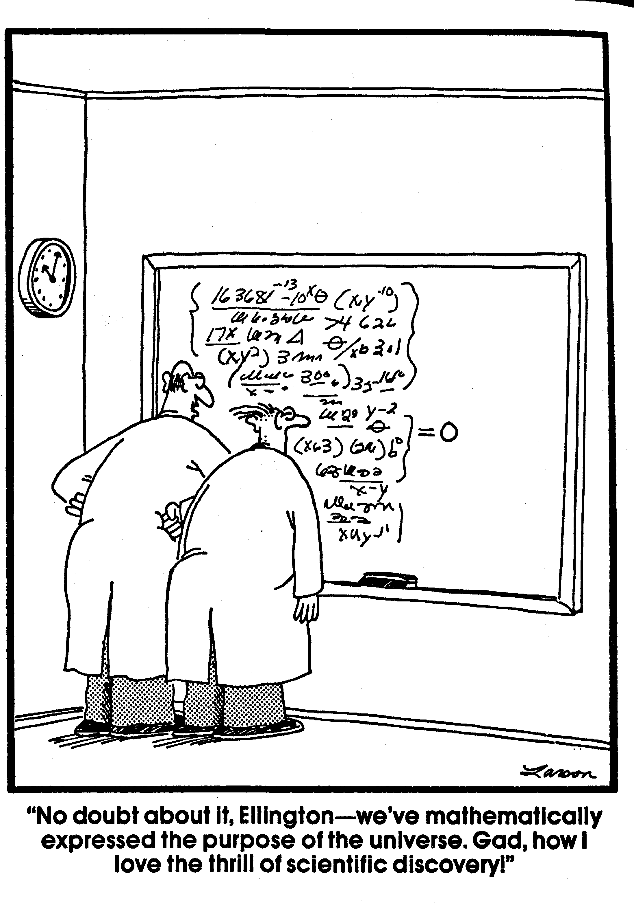

::: {title="header"}
\
:::

\

 [ ]{#Frame1 dir="ltr"
style="position: absolute; top: 0.86in; left: 0in; width: 4.94in; height: 0.85in; border: none; padding: 0in; background: #ffffff"}

[]{#_Ref456842800} Chemometric analysis of acid-base measurements

A multivariate approach

\

\

\

\
[ ]{#Frame2 dir="ltr"
style="float: left; width: 6.45in; height: 1.89in; border: none; padding: 0in; background: #ffffff"}

ISBN: 90-9013351-8

\

© M. Hekking, 1999

Chemometric Analysis of Acid-Base Measurements. A Multivariate Approach.

Thesis Erasmus University Rotterdam.

No part of this book may be reproduced without permission of the author.

\

\
\
\
[ ]{#Frame3 dir="ltr"
style="position: absolute; top: 0in; left: 0in; width: 2.02in; height: 0.47in; border: none; padding: 0in; background: #ffffff"}

**Acknowledgement**

\

[ ]{#Frame4 dir="ltr"
style="float: left; width: 3.01in; height: 3.07in; border: none; padding: 0in; background: #ffffff"}

The work presented in this thesis was partly supported by a grant for
scientific research from the 'Onze Lieve Vrouwe Gasthuis' (Amsterdam,
The Netherlands) and the 'St. Elisabeth Ziekenhuis' (Tilburg, The
Netherlands).

[ ]{#Frame5 dir="ltr"
style="position: absolute; top: 0in; left: 0in; width: 6.18in; height: 0.71in; border: none; padding: 0in; background: #ffffff"}

\

Financial support by IMRO TRAMARKO bv for the publication of this thesis
is gratefully acknowledged.

\

 [ ]{#Frame6 dir="ltr"
style="position: absolute; top: 2.17in; left: 0in; width: 6.99in; height: 8.45in; border: none; padding: 0in; background: #ffffff"}

Chemometric analysis of acid-base measurements

A multivariate approach

\

\

chemometrische analyse van zuur-base metingen

Een multivariate benadering

\

\

\

PROEFSCHRIFT

\

ter verkrijging van de graad van doctor aan de\
Erasmus Universiteit Rotterdam op gezag van de Rector Magnificus
Prof.dr. P.W.C. Akkermans M.A.\
en volgens besluit van het College voor Promoties.

\

De openbare verdediging zal plaatsvinden op

woensdag 22 december 1999 om 15:45 uur

\
door

\

Marcel Hekking

geboren te 's-Gravenhage

\

\
\
\
[ ]{#Frame7 dir="ltr"
style="position: absolute; top: 0in; left: 0in; width: 1.91in; height: 0.24in; border: none; padding: 0in; background: #ffffff"}

[Promotiecommissie]{lang="nl-NL"}

[ ]{#Frame8 dir="ltr"
style="float: left; width: 4.06in; height: 0.32in; border: none; padding: 0in; background: #ffffff"}

[Promotor Prof.dr. E.S. Gelsema]{lang="nl-NL"}

[ ]{#Frame9 dir="ltr"
style="position: absolute; top: 0in; left: 0in; width: 4.06in; height: 1.42in; border: none; padding: 0in; background: #ffffff"}

\

[Overige leden: Prof.dr. H.A. Bruining]{lang="nl-NL"}

[ Prof.dr.ir. H.L. Vader]{lang="nl-NL"}

[ Prof.dr.ir. A. Hasman]{lang="nl-NL"}

\

[Co-promotor Dr. J. Lindemans]{lang="nl-NL"}

\

\

\
[ ]{#Frame12 dir="ltr"
style="position: absolute; top: 0in; left: 0in; width: 5.52in; height: 5.97in; border: none; padding: 0in; background: #ffffff"}

THE FAR SIDE by Gary Larson

{width="343" height="485"}

\

\

[T]{lang="en-US"}[HE FAR SIDE © FARWORKS, INC. Used by permission of
UNIVERSAL PRESS SYNDICATE. All rights reserved.]{lang="en-US"}

\

\

::: {title="footer"}
i
:::
