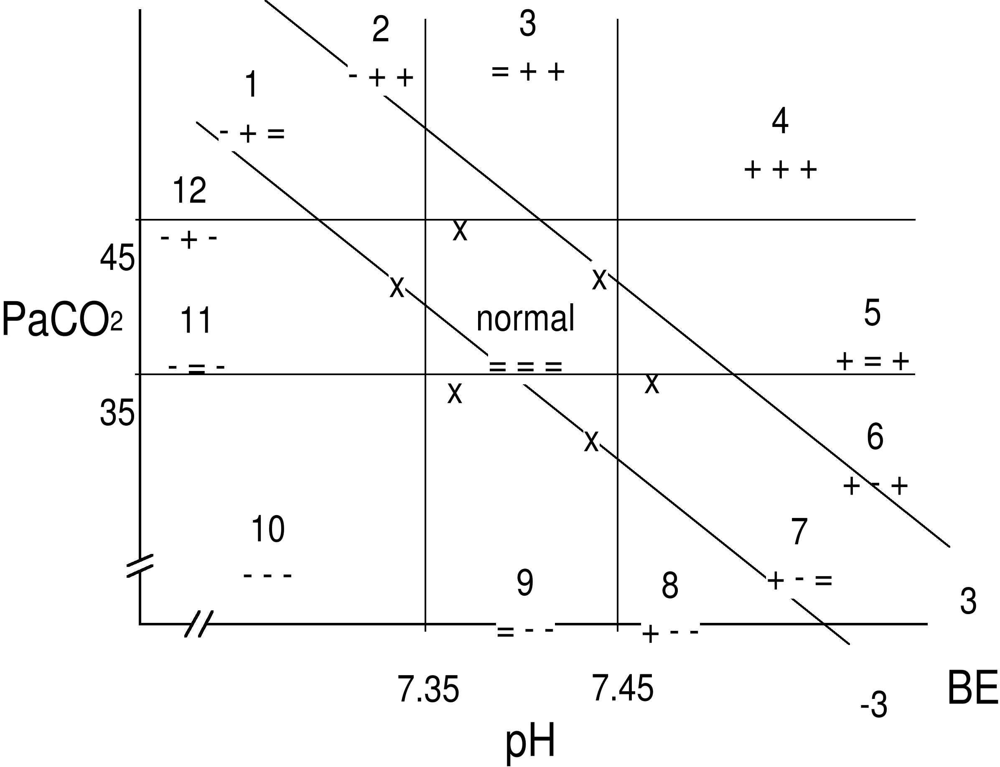

# General introduction

## The role of clinical chemistry in medicine

Medicine is an art and a science in the service of fellow human beings
\[1\]. On the basis of collected empirical data and information,
clinicians select specific diagnoses, rule out other differential
diagnoses and eventually make decisions about which and how specific
therapeutic interventions are made for the benefit and health of their
patients. For a proper interpretation, collected data and information
must be compared with other, already existing, data and information to
assess the exact value of the clinician's findings. Moreover, a
clinician compares observed medical data of a patient with knowledge
obtained during his or her training as a clinician and with the
experience obtained by working with other patients.

A prerequisite in this paradigm, however, is that collected empirical
data on which the diagnoses of a clinician are based must be as
objective as possible. Clinical chemistry takes a pivotal role in this
in the sense that the chemical characterisation of a patient's body
fluid is one of the ways in medicine that can provide such objective
data. Since the beginning of this century, clinical chemistry has
evolved into a separate and independent discipline in the field of
medicine \[2-4\]. Nowadays, most often a single central clinical
chemistry laboratory takes care of the 'analytical needs' of one or more
hospitals.

Tasks of the clinical chemist typically include the improvement of
existing methods of chemical analysis, the development of new analytical
methods and providing the clinician with as much information as possible
on the basis of chemical analyses. Especially this last task forms the
basis of what has become known as *chemometrics*, a branch of clinical
chemistry that uses mathematical and statistical methods to extract a
maximum of information from chemical analyses \[5, 6\].

This thesis presents a multivariate chemometric approach to the problems
that are currently associated with the interpretation and evaluation of
those laboratory measurements that are used to assess the arterial
acid-base status of a patient in an intensive care unit (ICU).

## Arterial acid-base measurements in the ICU

The ICU of today is a highly specialised ward in which expert medical,
nursing and technical staff provides medical services to severely ill
patients. It is characterised as a high-tech environment in which the
real-time monitoring of vital functions plays a central role. The origin
of the ICU can be traced back to the second half of the 19^th^ century
when special rooms, adjacent to the operating room, were used primarily
for the purpose of postoperative care \[7\]. In the course of time,
these recovery rooms evolved into specialised respiratory care units and
shock and trauma units, eventually leading to the present day ICU. The
modern ICU provides integrated cardiopulmonary support for both medical
and surgical patients suffering from severe respiratory and / or cardiac
problems as a result of disease or trauma.

The most frequently ordered chemical test in the ICU is the arterial
blood gas measurement \[8\]. Arterial blood gas measurements comprise
those measurements of the patient's arterial blood that are used for the
evaluation and interpretation of the patient's oxygen and acid-base
status. Basic arterial blood gas measurements include: the partial
pressure of oxygen ($\ce{PaO2}$), the oxygen saturation of haemoglobin, the $\ce{pH}$ of arterial blood, the partial pressure of carbon dioxide ($\ce{PaCO2}$) and the bicarbonate-ion concentration (a$[\ce{HCO3-}]$). The
first two measurements ($\ce{PaO2}$ and oxygen saturation) are used to
evaluate the oxygen status, while the other three are used for the
interpretation of the arterial acid-base status.

In a strict sense, the term blood gas measurements is incorrect, since
only $\ce{PaO2}$ and $\ce{PaCO2}$ are true gas measurements and in modern chemical analysers a$[\ce{HCO3-}]$ is not measured but calculated from
measured $\ce{pH}$ and $\ce{PaCO2}$. Moreover, two other derived acid-base
parameters are generally considered part of the set of arterial blood
gas measurements. These parameters are the standard bicarbonate-ion
concentration (SB) and the base excess ($\ce{BE}$). Their derivation and
rationale are described in section 1.4.3 in more detail.

Since the second half of this century, the analysis of arterial blood
for the purpose of acid-base characterisation has become a vital part of
intensive care medicine. The importance of the acid-base
characterisation of arterial blood is illustrated by the severe polio
epidemic that struck Copenhagen (Denmark) in 1952 \[9\]. During this
epidemic, hospitals in Copenhagen had to cope with a large number of
patients needing intensive artificial respiration as a result of
paralysis of the respiratory muscles. For a proper setting of the
artificial respiration, the complete acid-base status of the patient had
to be known. At that time, arterial blood of patients was seldom sampled
for the purpose of performing blood gas measurements \[10\]. Arterial
blood gas measurements were mainly performed in physiological
laboratories and were not part of daily clinical practice. Techniques of
measurement were cumbersome and needed large equipment.

The clinical necessity of quickly knowing the patient's arterial
acid-base status for the purpose of a proper adjustment of the
artificial respiration inspired Poul Astrup to develop his equilibration
method \[9\]. This method allowed a relatively quick determination of
the three basic acid-base parameters by only measuring the $\ce{pH}$ of an
arterial blood sample and the $\ce{pH}$ of the sample equilibrated at two known
$\ce{PaCO2}$ gas tensions. The original $\ce{PaCO2}$ is calculated by
interpolation \[11, 12\]. Since then, techniques of analysis developed
and arterial acid-base measurements have become routine and
indispensable in the daily clinical care of intensive care patients.

## Basic acid-base physiology

In chemical terms, acids are substances that are capable of donating
hydrogen ($\ce{H+}$) ions while bases are substances capable of accepting
$\ce{H+}$ ions. The amount of $\ce{H+}$ ions in the arterial blood
determines its actual acidity. Acidity is measured as $\ce{pH}$, which is,
according to the definition of Sörensen, the negative logarithm of the
$\ce{H+}$ concentration ($\ce{[H+]}$) \[9\].

The regulation of the amount of $\ce{H+}$ ions in the arterial blood and
consequently its $\ce{pH}$ is one of the most powerful controlling mechanisms
in the human body. Under normal physiologic conditions, the $\ce{pH}$ of
arterial blood is kept within well-defined limits. This tight regulation
of the $\ce{H+}$ concentration in arterial blood is essential since
$\ce{H+}$ ions are highly reactive with negatively charged parts of
molecules. Changes in $\ce{H+}$ concentration (intra-cellular as well as
extra-cellular) therefore have a profound influence on the molecular
configuration and consequently on protein function \[13\]. Hence,
maintaining a constant $\ce{pH}$ ensures an optimal working condition for
enzymes and other proteins. Moreover, large deviations in $\ce{pH}$ may have
effects on the nervous system. If the body becomes too acidic, the
nervous system can become so depressed that death can occur. On the
other hand, if the body becomes too alkaline, the nervous system can
become overexcited, resulting in death from tetanus of the respiratory
muscle \[14\].

Two mechanisms exist to regulate $\ce{pH}$ of arterial blood: long term
physiological buffering and short term chemical buffering. Physiological
buffering is the redistribution, production, excretion and/or retention
of (non-)volatile acids and bases by means of physiological processes.
Chemical buffering is the result of the presence of weak acids and their
conjugated bases in the arterial blood. Examples of chemical buffers in
arterial blood are: inorganic phosphate, organic phosphate and
haemoglobin.

One of the most important chemical buffer systems in the blood, however,
is the bicarbonate ion ($\ce{HCO3-}$)/carbon dioxide ($\ce{CO2}$)
buffer system. It is mainly the presence of this buffer system that
makes it possible for the human body to cope with the constant load of
exogenous acids and bases and the vast amount of both volatile and
non-volatile acids that are continuously generated as a result of normal
metabolism.

The equation describing the $\ce{HCO3-}$/$\ce{CO2}$ buffer system in
blood is:

$$\ce{CO2 + H2O <=> H2CO3 <=> H+ + HCO3-}$$
(1--1)

The left-hand side of this chemical reaction represents the formation of
carbonic acid ($\ce{H2CO3}$) from $\ce{CO2}$ and $\ce{H2O}$. Therefore, although
$\ce{CO2}$ itself is not an acid, an elevation of the $\ce{CO2}$ in the blood
increases the acidity of the blood through the formation of $\ce{H2CO3}$
which immediately dissociates into protons ($\ce{H+}$) and bicarbonate
ions ($\ce{HCO3-}$).

Since the concentration of $\ce{H2CO3}$ is so low in relation to the
concentration of dissolved $\ce{CO2}$ and the concentration of
$\ce{HCO3-}$, the law of mass action for the
$\ce{HCO3-}$/$\ce{CO2}$ buffer system is:

$$\ce{K = \frac{[H+]\times[HCO3^-]}{[CO2]\times[H2O]}}$$
(1--2)

where $\ce{K}$ is a constant.

Because $\ce{H2O}$ is relatively constant in body fluids, it can be
omitted from the equation and incorporated into the constant $\ce{K}$, further indicated as $\ce{K}'$ \[13\]. Rewriting the resulting equation to solve \[$\ce{H+}$\] yields the equation that Lawrence Joseph Henderson
(1878-1942) first described in 1909 \[10\]:

$$\ce{[H+] = $\ce{K}'$ \times \frac{[CO2]}{[HCO3^-]}}$$
(1--3)

The concentration of dissolved $\ce{CO2}$ in blood (\[$\ce{CO2}$\]) is proportional to the partial pressure of $\ce{CO2}$ ($\ce{PCO2}$) in the gas with which the blood is in equilibrium. Therefore, $\ce{[CO2]}$ can be replaced by the partial pressure of $\ce{CO2}$ in the blood. Partial pressures are either measured in millimetres mercury (mmHg) or kilo-Pascal (kPa) where 1 mmHg = 0.133 kPa. The constant relating $\ce{[CO2]}$ in mmol/l to the $\ce{PCO2}$ is called the solubility constant. The solubility constant for $\ce{[CO2]}$ in plasma is 0.03 mmol per litre per mmHg or 0.225 mmol per litre per kPa.

Moreover, applying the $\ce{pH}$ concept of Sörensen, in 1917 Karl Albert
Hasselbalch (1874-1962) introduced the Henderson-Hasselbalch equation:

$$\ce{pH = $\ce{pK}'$  + log\frac{[HCO3^-]}{\alpha PCO2}}$$
(1--4)

where $\ce{pK}'$ = 6.10 and $\alpha$ is the solubility constant for $\ce{[CO2]}$ in plasma.

From equation 1--4 it is apparent that $\ce{pH}$ is the resultant of the ratio $[\ce{HCO3-}]$/$\ce{PCO2}$. Both $\ce{PCO2}$ and $[\ce{HCO3-}]$ can effectively be regulated by lungs and kidneys, respectively \[15\]. This feature in particular makes the $\ce{HCO3-}$/$\ce{CO2}$ buffer system so
effective in maintaining a constant arterial blood $\ce{pH}$. Knowing $\ce{pH}$, $\ce{PCO2}$ and $[\ce{HCO3-}]$ in the arterial blood of a
patient is vital when interpreting the acid-base status of arterial
blood. It gives information on both the respiratory and metabolic
component of an acid-base disturbance and their joint effect on the
acidity of the arterial blood.

Although Sörensen introduced the electrochemical measurement of $\ce{H+}$
ions as early as in 1909, it was not until 1932 that $\ce{pH}$ glass electrodes
were produced commercially and used on a regular basis. Before that
time, $\ce{pH}$ of blood was indirectly obtained from measuring total $\ce{CO2}$ and $\ce{PCO2}$  in the blood with the manometric Van Slyke
apparatus that Donald Dexter van Slyke (1883-1971) introduced in 1924
\[9\]. Around 1960 the $\ce{CO2}$ electrode was introduced into clinical
chemistry. Today, chemical analysers measure $\ce{pH}$ and $\ce{PCO2}$ and calculate $[\ce{HCO3-}]$ with the use of the Henderson-Hasselbalch
equation (see Equation 1 --4).

## The clinical interpretation of acid-base parameters

An impairment in either the respiratory or metabolic function (or both)
of the body may result in so-called acid-base disturbances \[13\]. For a
proper treatment of these disturbances it is essential for an ICU
clinician to be aware of the exact acid-base status of the arterial
blood of an ICU patient. With the analysis of measured and calculated
arterial acid-base parameters, the ICU clinician aims to find the
underlying cause(s) of one or more acid-base disturbances in order to
remove it with specific therapeutic interventions. Moreover, for
patients receiving artificial respiration, the acid-base analysis of
arterial blood is essential for setting the kind and degree of
artificial respiration.

### General nomenclature and terminology

Acid-base disorders can be divided into *primary*, *secondary* and
*combined* acid-base disturbances. Primary acid-base disturbances are
the result of impairment of either the respiratory function or the
metabolic function of the body. Impairments of the respiratory function
result in primary *respiratory* acid-base disturbances, whereas
impairments in metabolic function result in *non-respiratory* or
*metabolic* disturbances. Both respiratory and metabolic disturbances
can be further divided into disturbances that tend to lower the $\ce{pH}$,
resulting in *acidemia*, and disturbances that tend to raise the $\ce{pH}$,
resulting in *alkalemia*. These acid-base disturbances are called
*acidoses* and *alkaloses*, respectively. Hence, the terms acidosis and
alkalosis refer to underlying $\ce{pH}$-deranging physiologic processes,
whereas the terms acidemia and alkalemia merely indicate the actual
acidity of arterial blood. Multiple single primary acid-base
disturbances can be present at the same time, resulting in *combined*
acid-base disturbances.

Moreover, as a response to primary acid-base disorders, the human body
is capable of initiating compensating mechanisms. Primary respiratory
disturbances trigger mechanisms in the kidneys that actively regulate
the reabsorbtion of excreted $\ce{HCO3-}$ ions, thereby inducing
metabolic compensating effects. Also, primary metabolic dysfunction
eventually triggers the breathing centre, resulting in an adjustment of
the respiration and consequently the $\ce{PaCO2}$. These compensating
processes result in *secondary* acid-base disturbances. The capability
of the body to compensate for primary acid-base disturbances prevents
large changes in the $\ce{pH}$ of arterial blood even though pathological
processes may be present.

Respiratory compensations are very rapid and effective within minutes,
while metabolic compensations can take up to three days to be fully
effective. A metabolic compensation can, however, when in full working
order, completely compensate a primary respiratory disturbance, while a
respiratory compensation can only partially compensate primary metabolic
acid-base disturbances.

It is apparent that for a proper treatment of an acid-base disturbance,
the complete acid-base status of a patient should be known to a
clinician. Although the body can compensate primary acid-base
disturbances to a certain extent, therapeutic measurements must be taken
as soon as possible to eliminate any primary acid-base disturbance.
Moreover, severely ill patients on the ICU most often receive some form
of artificial respiration. Being on mechanical ventilation means that
the body cannot fully employ respiratory compensating mechanisms, making
the ICU clinician even more responsible for keeping the $\ce{pH}$ of the
arterial blood within acceptable boundaries.

For most ICU patients, an arterial blood gas analysis is performed on a
routine basis, for instance every 3 or 6 hours. However, the
interpretation of acid-base data is still regarded as difficult since
several pieces of information must be evaluated at the same time in
their clinical context. Multiple primary disturbances can be present at
the same time, concealed by various degrees of compensation, making the
diagnosis and monitoring of acid-base data a complex task.

This complexity is illustrated by the coexistence of two distinct
methods for interpreting arterial acid-base parameters. One method uses
*in vivo* information to interpret $\ce{pH}$, $\ce{PaCO2}$ and
$[\ce{HCO3-}]$, while the other method makes use of $\ce{pH}$,
$\ce{PaCO2}$ and a calculated *in vitro* parameter called base
excess ($\ce{BE}$). This latter method was developed around 1960 by Poul Astrup
and Ole Siggaard-Andersen from Denmark and is therefore also known as
the *Scandinavian view* \[16\].

Schwartz and Relman of the Tufts University School of Medicine in Boston
(USA) criticised the *in vitro* approach and made a case for $\ce{pH}$,
$\ce{PaCO2}$ and $[\ce{HCO3-}]$ \[17\]. This method
is therefore also known as the *North American view*. The controversy
between the two schools, which Bunker called 'The Great Trans-Atlantic
Acid-Base Debate', still exists today, although many attempts were made
to bridge the gap \[16, 18-22\].

### The North American view; $[\ce{HCO3-}]$ and in vivo $\ce{CO2}$ buffer lines

In the North American view, a high value of $\ce{PaCO2}$
indicates a primary respiratory acidosis or a respiratory compensation
for a metabolic alkalosis, while a low value of $\ce{PaCO2}$
indicates a primary respiratory alkalosis or a respiratory compensation
for a primary metabolic acidosis. The metabolic component of an
acid-base status is assessed with $[\ce{HCO3-}]$. A high
value of $[\ce{HCO3-}]$ indicates a primary metabolic
alkalosis or a metabolic compensation for a primary respiratory acidosis
while a low $[\ce{HCO3-}]$ indicates a primary metabolic
acidosis or a metabolic compensation for a primary respiratory acidosis.
However, $[\ce{HCO3-}]$ cannot be used as a true metabolic
parameter, since changes in $\ce{PaCO2}$ also effect
$[\ce{HCO3-}]$.

The concept of the North American view is that *in vivo* data is used to
calculate the expected rise or fall in $[\ce{HCO3-}]$ and/or
$\ce{PaCO2}$ that occur in specific acid-base disorders. The empirically
derived *in vivo* information has been compiled from a large number of
clinical studies in which the normal compensatory reactions to each of
the primary acid-base disorders has been investigated and quantified
\[23-30\]. An observed value of $[\ce{HCO3-}]$ or $\ce{PaCO2}$
below or above the expected value of $[\ce{HCO3-}]$ or
$\ce{PaCO2}$ is an indication for the presence and nature of a metabolic
component or respiratory component of an acid-base disorder. Table 1 --1
presents the empirically found expected compensatory rise and fall in
$[\ce{HCO3-}]$ and $\ce{PaCO2}$ for the primary acid-base
disturbances.

*Table 1--1. Compensations to primary acid-base disturbances in the North American view \[13\].*

 disorder | primary change | compensatory response
----------|----------------|----------------------
 metabolic acidosis | ↓ $[\ce{HCO3-}]$ | 1.2 mmHg decrease in $\ce{PaCO2}$ for every 1 mmol/l fall in $[\ce{HCO3-}]$
 metabolic alkalosis | ↑ $[\ce{HCO3-}]$ | 0.7 mmHg elevation in $\ce{PaCO2}$ for every 1 mmol/l rise in $[\ce{HCO3-}]$
 respiratory acidosis | ↑ $\ce{PaCO2}$
 acute | |1 mmol/l elevation in $[\ce{HCO3-}]$ for every 10 mmHg rise in $\ce{PaCO2}$
 chronic | |3.5 mmol/l elevation in $[\ce{HCO3-}]$ for every 10 mmHg rise in $\ce{PaCO2}$
 respiratory alkalosis | ↓ $\ce{PaCO2}$
 acute | |2 mmol/l decrease in $[\ce{HCO3-}]$ for every 10 mmHg fall in $\ce{PaCO2}$
 chronic | |5 mmol/l decrease in $[\ce{HCO3-}]$ for every 10 mmHg fall in $\ce{PaCO2}$

### The Scandinavian view; standard bicarbonate and base excess

The North American view requires calculations to be performed at the
bedside of a patient. Moreover, to predict the amount of rise or fall in
primary acid-base values, the acid-base disturbance of a patient should
be known *a priori*. To overcome the 'problems' of bedside calculations
and the paradox of classifying an already known acid-base disturbance,
Astrup and Siggaard-Andersen developed the concept of the standard
bicarbonate and the base excess as true metabolic acid-base parameters
\[11\].

In 1960, Astrup described his equilibration method for the rapid
measurement and calculation of the primary acid-base parameters $\ce{pH}$,
$\ce{PaCO2}$ and $[\ce{HCO3-}]$ \[12 , 31\]. In a
microtonometer a blood sample is equilibrated with two known $\ce{CO2}$ gas
mixtures, one with a high $\ce{PaCO2}$ and one with a low
$\ce{PaCO2}$. Plotting $\ce{PaCO2}$ and measured $\ce{pH}$ at
both $\ce{PaCO2}$ values in a log $\ce{PaCO2}$--$\ce{pH}$
diagram, and connecting the two points with a line yields the *in vitro*
$\ce{CO2}$ equilibration curve. By measuring $\ce{pH}$ of the original blood sample
and putting it in the plot, the actual $\ce{PaCO2}$ of the
blood sample can be read from the $\ce{CO2}$ equilibration curve. With the
Henderson-Hasselbalch equation $[\ce{HCO3-}]$ can be
calculated.

With the log $\ce{PaCO2}$--$\ce{pH}$ chart and the *in vitro* $\ce{CO2}$
equilibration curve of a patient, $[\ce{HCO3-}]$ can be
calculated at any desired $\ce{PaCO2}$ value. Astrup proposed to use the
$[\ce{HCO3-}]$ of a blood sample at a $\ce{PaCO2}$
of 40 mmHg as a true metabolic parameter, since this would be the
concentration that would have been found in the blood sample if the
influence of the respiration was eliminated. He called it the standard
bicarbonate concentration or SB.

At the same time, Siggaard-Andersen completed his titration experiments
in which he determined the $\ce{CO2}$ equilibration curves of normal blood
and blood with known amounts of non-volatile acids and bases at a fixed
$\ce{PaCO2}$ of 40 mmHg. Based on these experiments he added to
the log $\ce{PaCO2}$--$\ce{pH}$ diagram of Astrup a curved line
representing the amount of non-volatile acid or base needed to titrate
the blood sample at a $\ce{PaCO2}$ of 40 mmHg to a $\ce{pH}$ of 7.40
at a temperature of 37 °C. Astrup and Siggaard-Andersen called this the
base excess or $\ce{BE}$. Positive base excess values indicate a relative
deficit of non-volatile acids while negative base excess values indicate
a relative surplus of non-volatile acids. A base excess of 0 means that
there is no metabolic component in the acid-base disorder. In modern
analysers, $\ce{BE}$ is calculated from $\ce{pH}$, $\ce{PaCO2}$, $[\ce{HCO3-}]$
and the haemoglobin concentration of the arterial blood sample at hand.

The most important argument against the use of standard bicarbonate and
base excess is that they are determined *in vitro*. The *in vitro* $\ce{CO2}$
equilibration curve is the equilibration curve of whole blood in a tube
or syringe. It has been shown that *in vivo* buffering of protons is
different from the in *vitro* buffering of protons \[17\]. This is
mainly because *in vivo* buffering takes place in the extracellular
fluid in which the haemoglobin concentration (a powerful chemical
buffer) is lower than in whole blood. Both Siggaard-Andersen himself and
Severinghaus proposed to calculate $\ce{BE}$ not with the measured haemoglobin
concentration of the sample, but with a haemoglobin concentration of 5
g/dl, which is the Hb concentration relative to the total volume of
extracellular fluid of the body \[32, 33\]. This $\ce{BE}$ is also known as
BEecf (Base Excess of extracellular fluid), SBE (Standard Base Excess)
and BE5 (Base Excess at a haemoglobin concentration of 5 g/dl.

With $\ce{BE}$ as a true metabolic parameter, classifying acid-base
disturbances is now straightforward. Figure 1 --1 and Table 1 --2
show all possible acid-base classifications based on $\ce{pH}$, $\ce{PaCO2}$ and $\ce{BE}$.

\newpage

\blandscape

*Table 1--2. Classification of acid-base disorders in the Scandinavian view. The signs '-', '+' and '=' indicate an observed value being respectively below, above or within its 95% normal reference interval. See also Figure 1--1.*

 |   | $\ce{pH}$ | $\ce{PaCO2}$ | $\ce{BE}$ | classification
-|-----------|---------|-----------|---------------
 | 1 | \- | \+ | = | respiratory acidosis
 | 2 | \- | \+ | \+ | partly compensated respiratory acidosis
 | 3 | = | \+ | \+ | compensated respiratory acidosis OR compensated metabolic alkalosis OR combined respiratory acidosis and metabolic alkalosis
 | 4 | \+ | \+ | \+ | partly compensated metabolic alkalosis
 | 5 | \+ | = | \+ | metabolic alkalosis
 | 6 | \+ | \- | \+ | combined respiratory and metabolic alkalosis
 | 7 | \+ | \- | = | respiratory alkalosis
 | 8 | \+ | \- | \- | partly compensated respiratory alkalosis
 | 9 | = | \- | \- | compensated respiratory alkalosis OR compensated metabolic acidosis OR combined respiratory alkalosis and metabolic acidosis
 | 10 | \- | \- | \- | partly compensated metabolic acidosis
 | 11 | \- | = | \- | metabolic acidosis
 | 12 | \- | \+ | \- | combined respiratory and metabolic acidosis
 |    | = | = | = | normal
 | x | unclassifiable

\elandscape

To determine whether an observed value for an acid-base parameter is too
low, normal or too high, standard univariate 95% reference intervals are
used. Table 1 --3 presents the associated upper and lower cut-off
values for the univariate 95% reference intervals of arterial $\ce{pH}$,
$\ce{PaCO2}$, $\ce{BE}$ and $[\ce{HCO3-}]$.

\bcenter

{width="75%"}

\ecenter

*Figure 1--1. Areas of acid-base classification according to the method presented in Table 1--2. Combinations of low, high or normal observed values yield 12 specific acid-base disorder regions. In the normal region, all values are within their standard 95% normal reference intervals. The 'x' regions are formally not classifiable \[34\]. In these regions, one of the three observed acid-base values is outside its 95% univariate reference interval.*

*Table 1--3. Upper and lower limits of the standard 95% normal reference intervals for the acid-base variables in arterial blood.*

Acid-base variable    |      lower limit |  upper limit
----------------------|------------------|-------------
$\ce{pH}$             |            7.35  |        7.45
$\ce{PaCO2}$               |      35 mmHg     |  45 mmHg
$\ce{BE}$             |         -3 mmol/l|     3 mmol/l
$[\ce{HCO3-}]$        | 21 mmol/l        | 27 mmol/l

## Objective and scope of this thesis

Two main problems are currently associated with the interpretation and
evaluation of arterial acid-base measurements in an intensive care
setting.

The first problem occurs when classifying the acid-base variables $\ce{pH}$, $\ce{PaCO2}$ and $\ce{BE}$ according to the method described in section 1.4.3. A strict adherence to the classification rules as described in Table 1 --3
reveals that some combinations of observed values for the three
acid-base variables can formally not be classified. This was found when
an attempt was made to computerise the classification scheme of Astrup
and Siggaard-Andersen in a rule-based expert system \[34\]. Typically,
the *unclassifiable* situation occurs when only one of the three
observed acid-base values is outside its 95% univariate reference
interval, while the other two are within their 95% univariate intervals.
In Figure 1 --1, this situation is represented by the triangular regions
denoted by 'x'.

The second problem originates from the use of the 95% univariate
reference interval as the standard statistical model for evaluating the
'normalcy' of observed arterial acid-base values from intensive care
patients.

A first critical note on the use of 95% reference intervals is that the
determination of the respective reference intervals and the
characteristics of the reference population are completely unknown. In
general, reference intervals are derived from a representative sample of
a (often) 'healthy' reference population \[35\]. The process of defining
the reference criteria, the selection of reference individuals,
analytical considerations and the use of statistical techniques for
defining valid 95% univariate reference intervals are described in
detail \[36-40\]. Nothing is known, however, about the determination of
the 95% univariate reference intervals that are presented in Table 1
--2. If we assume that the intervals are defined on a 'healthy'
reference population, what is the value of these intervals in an
intensive care setting where it is to be expected that most of the
observed acid-base values will be outside these 'health'-based
intervals?

A second critical note concerns the number of reference intervals used.
Traditionally, the interpretation of the acid-base status involves the
use of three separate 95% reference intervals for evaluating the
acid-base variables: $\ce{pH}$, $\ce{PaCO2}$ and $[\ce{HCO3-}]$ in the
North American view, or $\ce{pH}$, $\ce{PaCO2}$ and $\ce{BE}$ in the Scandinavian view.
From the Henderson-Hasselbalch equation (Equation 1 --4), however,
it is apparent that the relationship between $\ce{pH}$, log $\ce{PCO2}$ and log $[\ce{HCO3-}]$ is a linear one. This can best be appreciated
when Equation 1 --4 is rewritten as:

$$\ce{pH - log [HCO3^-] + log PCO2= $\ce{pK}'$  - log $\ce{\alpha}$}$$
(1--5)

with $\ce{pK}'$ and log $\alpha$ both being constant.

Moreover, in Chapter 2 it will be
demonstrated that the relationship between $\ce{pH}$, $\ce{PaCO2}$ and $\ce{BE}$ is also
(almost) linear. Consequently, as Madias \[41\] already pointed out, it
is illogical and fundamentally wrong that three separate 95% univariate
reference intervals are used, while only two of the three variables can
change independently.

A third critical note on the use of univariate 95% reference intervals
is that the 95% univariate interval is not the proper statistical model
for evaluating arterial acid-base values. Theoretically, the use of more
than one 95% univariate reference interval in case of a simultaneous
evaluation of multiple variables -- which is the case when interpreting
arterial acid-base values -- is prone to error and leads *a priori* to
more false positive and false negative observations \[42-44\]. This will
be illustrated in detail in Chapter 4.

This thesis describes a new multivariate statistical reference model for
evaluating and classifying arterial acid-base variables in an intensive
care environment that addresses all of the above mentioned problems. The
essence of the model is that a single 95% multivariate statistical
reference region is defined on a large reference population consisting
of acid-base data coming from intensive care patients themselves.
Furthermore, the multivariate reference model is not defined on the
original acid-base measurements but rather on the values obtained after
applying a mathematical data reduction transformation procedure.
Finally, based on the outcome of this transformation, a new way of
classifying $\ce{pH}$, $\ce{PaCO2}$ and $\ce{BE}$ values will be proposed that will have no
*unclassifiable* categories, unlike the method described in 1.4.3.

The outline of this thesis is as follows. In Chapter 2, the mathematical data reduction technique will be
introduced, together with the results of various transformed large
acid-base data sets coming from several ICUs. In Chapter 3, a two-dimensional graphical representation
of the three acid-base variables will be presented, based on the
mathematical transformation as described in Chapter 2. Also, the new classification model for $\ce{pH}$, $\ce{PaCO2}$ and
$\ce{BE}$ combinations will be described. Then, in Chapter 4, the technique for defining a 95% multivariate
patient-based reference region for the acid-base variables will be
described. Chapter 5 presents the
computational methods involved in the data reduction transformation
procedure and the construction of the multivariate reference model. It
also presents the prototype computer programs that were built for
defining multivariate acid-base reference regions and describes their
use in daily clinical practice. Chapter 6 exemplifies the use and practicability of the proposed graphical
representation of acid-base data using measurements from three intensive
care patients. In Chapters 7 and 8, the results of the clinical evaluation of
the multivariate acid-base reference regions and classification model
can be found. The thesis is concluded with a general discussion.

## References

1\. Solberg HE. Establishment and use of reference values. In: Burtis
CA, Ashwood ER, eds. Tietz textbook of clinical chemistry. 2nd Edition,
W.B. Saunders Company, 1994; 454-484.2.\
2\. Guder WG, Büttner J. Clinical
chemistry in laboratory medicine in Europe-past, present and future
challenges. *Eur J Clin Chem Clin Biochem* 1997; 35:487-494.3. \
3\. Sunderman
FW, Sr. The foundation of clinical chemistry in the United States. *Clin
Chem* 1994; 40:835-842.4. \
4\. Büttner J. Clinical chemistry as scientific
discipline: historical perspectives. *Clin Chim Acta* 1994; 232:1-9.5. \
5\. Wold S. Chemometrics, why, what and where to next? *J Pharm Biomed Anal*
1991; 9:589-596.6. \
6\. Karjalainen EJ. The role of chemometrics in medical
decision making. *Scand J Clin Lab Invest Suppl* 1990; 202:109-111.7.\
7\. Weil MH, Von Planta M, Rackow EC. Critical care medicine: introduction
and historical perspective. In: Shoemaker W, ed. Textbook of Critical
Care. 2nd Edition, Philadelphia: W.B. Saunders Company, 1989; 1-5.8.\
8\. Muakkassa FF, Rutledge R, Fakhry SM, et al. ABG\'s and arterial lines:
the relationship to unnecessarily drawn arterial gas samples. *J Trauma*
1990; 30:1087-1095.9. \
9\. Severinghaus JW, Astrup PB. History of blood gas
analysis. Boston: Little, Brown and Company, 1987, Lange BP, ed.,
*International Anesthesiology Clinics*; vol 25.10. \
10\. Astrup P,
Severinghaus JW. The history of blood gases, acids and bases. The
history of blood gases, acids and bases. 1st Edition, Copenhagen:
Munksgaard International Publishers, 1986; 264-295.11. \
11\. Astrup P,
Jörgensen K, Siggaard-Andersen O, et al. The acid-base metabolism, a new
approach. *Lancet* 1960;1035-1039.12.
12\. Astrup P. A new approach to
acid-base metabolism. *Clin Chem* 1961; 7:1-15.13. \
13\. Rose BD. Clinical
Physiology of Acid-Base and Electrolyte Disorders. 4th Edition, New
York: McGraw-Hill, Inc., 1994; 853.14. \
14\. Hainsworth R. Acid-base balance.
Physiological Society Study Guides. Manchester: Manchester University
Press, 1986; 155; vol 1.15. \
15\. Lane EE, Walker JF. Clinical arterial blood
gas analysis. St. Louis: The C.V. Mosby Company, 1987; 247.16. \
16\. Bunker
JP. The great trans-atlantic acid-base debate. *J Anesthesiol* 1965;
26:591-594.17. \
17\. Schwartz WB, Relman AS. A critique of the parameters used
in the evaluation of acid-base disorders. \"Whole-blood buffer base\"
and \"standard bicarbonate\" compared with blood $\ce{pH}$ and plasma
bicarbonate concentration. *New Engl J Med* 1963; 268:1382-1388.18.\
18\. Rispens P, Zijlstra WG, Van Kampen EJ. Significance of bicarbonate for
the evaluation of non-respiratory disturbances of acid-base balance.
*Clin Chim Acta* 1974; 54:335-347.19. \
19\. Siggaard-Andersen O, Fogh-Andersen
N. Base excess or buffer base (strong ion difference) as measure of a
non-respiratory acid-base disturbance. *Acta Anaesthesiol Scand Suppl*
1995; 107:123-128.20. \
20\. Severinghaus JW. Acid-base balance nomogram. A
Boston-Copenhagen détente. *Anesthesiology* 1976; 45:3-5.21.\
21\.  Severinghaus JW. Acid-base balance controversy. Editorial introduction.
*J Clin Monit* 1991; 7:274-275.22. \
22\. Severinghaus JW. Siggaard-Andersen
and the \"Great Trans-Atlantic Acid-Base Debate\". *Scand J Clin Lab
Invest* 1993; 53:99-104.23. \
23\. Arbus GS, Herbert LA, Levesque PR, et al.
Characterization and clinical application of the \"significance band\"
for acute respiratory alkalosis. *New Engl J Med* 1969; 280:117-123.24.\
24\. Bushinsky DA, Coe FL, Katzenberg C, et al. Arterial PCO2 in chronic
metabolic acidosis. *Kidney Int* 1982; 22:311-314.25. \
25\. Javaheri S, Shore
NS, Rose B, et al. Compensatory hypoventilation in metabolic alkalosis.
*Chest* 1982; 81:296-301.26. \
26\. Javaheri S, Kazemi H. Metabolic alkalosis
and hypoventilation in humans. *Am Rev Respir Dis* 1987;
136:1011-1016.27. \
27\. Pierce NF, Fedson DS, Brigham KL, et al. The
ventilatory response to acute base deficit in humans. Time course during
development and correction of metabolic acidosis. *Ann Intern Med* 1970;
72:633-640.28. \
28\. Polak A, Haynie GD, Hays GM, et al. Effects of chronic
hypercapnia on electrolyte and acid-base equilibrium. I. Adaptation. *J
Clin Invest* 1961; 40:1223.29.\
29\. Van Yperselle de S, Brasseur L, De
Coninck JD. The \"carbon dioxide response curve\" for chronic
hypercapnia in man. *New Engl J Med* 1966; 275:117-122.30.\
30\. Gennari FJ,
Goldstein MB, Schwartz WB. The nature of the renal adaptation to chronic
hypocapnia. *J Clin Invest* 1972; 51:1722-1730.31. \
31\. Siggaard-Andersen O,
Engel K, Jörgensen K, et al. A micro method for determination of $\ce{pH}$,
carbon dioxide tension, base excess and standard bicarbonate in
capillary blood. *Scand J Clin Lab Invest* 1960; 12:172-176.32.\
32\.Siggaard-Andersen O. An acid-base chart for arterial blood with normal
and pathophysiological reference areas. *Scand J Clin Lab Invest* 1971;
27:239-245.33. \
33\. Severinghaus JW. Acid-base balance controverse: case for
standard-base excess as the measure of nonrespiratory acid-base
imbalance. *J Clin Monit* 1991; 7:276-277.34. Wulkan RW. \
34\. Expert systems
and multivariate analysis in clinical chemistry. Rotterdam: Erasmus
University Rotterdam, 1992; 111 pp.35. \
35\. Solberg HE, Gräsback R. Reference
values. *Adv Clin Chem* 1994; 27:1 -79.36. \
36\. Dybkær R, Solberg HE.
International Federation of Clinical Chemistry (IFCC), Scientific
Committee, Clinical Section, Expert Panel on Theory of Reference Values,
and International Committee for Standardization in Haematology (ICSH),
Standing Committee on Reference Values. Approved Recommendation (1987)
on the theory of reference values. Part 6. Presentation of observed
values related to reference values. *J Clin Chem Clin Biochem* 1987;
25:657-662.37. \
37\. PetitClerc C, Solberg HE. International Federation of
Clinical Chemistry (IFCC). Approved Recommendation (1987) on the theory
of reference values. Part 2. Selection of individuals for the production
of reference values. *J Clin Chem Clin Biochem* 1987; 25:639-644.38.\
38\.Solberg HE, PetitClerc C. International Federation of Clinical Chemistry
(IFCC), Scientific Committee, Clinical Section, Expert Panel on Theory
of Reference Values. Approved recommendation (1988) on the theory of
reference values. Part 3. Preparation of individuals and collection of
specimens for the production of reference values. *J Clin Chem Clin
Biochem* 1988; 26:593-598.39. \
39\. Solberg HE. International Federation of
Clinical Chemistry (IFCC), Scientific Committee, Clinical Section,
Expert Panel on Theory of Reference Values. Approved recommendation
(1988) on the theory of reference values. Part 5. Statistical treatment
of collected reference values. Determination of reference limits. *J
Clin Chem Clin Biochem* 1987; 25:645-656.40. \
40\. Solberg HE. International
Federation of Clinical Chemistry (IFCC), Scientific Committee, Clinical
Section, Expert Panel on Theory of Reference Values, and International
Committee for Standardization in Haematology (ICSH), Standing Committee
on Reference Values. Approved Recommendation (1986) on the theory of
reference values. Part 1. The concept of reference values. *J Clin Chem
Clin Biochem* 1987; 25:337-342.41. \
41\. Madias NE, Adroqué HJ, Horowitz GL,
et al. A redefinition of normal acid-base equilibrium in man: Carbon
dioxide tension as a key determinant of normal plasma bicarbonate
concentration. *Kidney Int* 1979; 16:612-618.42. \
42\. Stamhuis IH, Bezemer
PD, Kuik D. Evaluation of univariate ranges with a multivariate
standard. *J Clin Epidemiol* 1988; 41:359-366.43. \
43\. Solberg HE.
Multivariate reference regions. *Scand J Clin Lab Invest Suppl* 1995;
222:3-5.44. \
44\. Schoen I, Brooks SH. Judgment based on 95% confidence
limits. *Statistical Considerations* 1969; 53:190-193.
