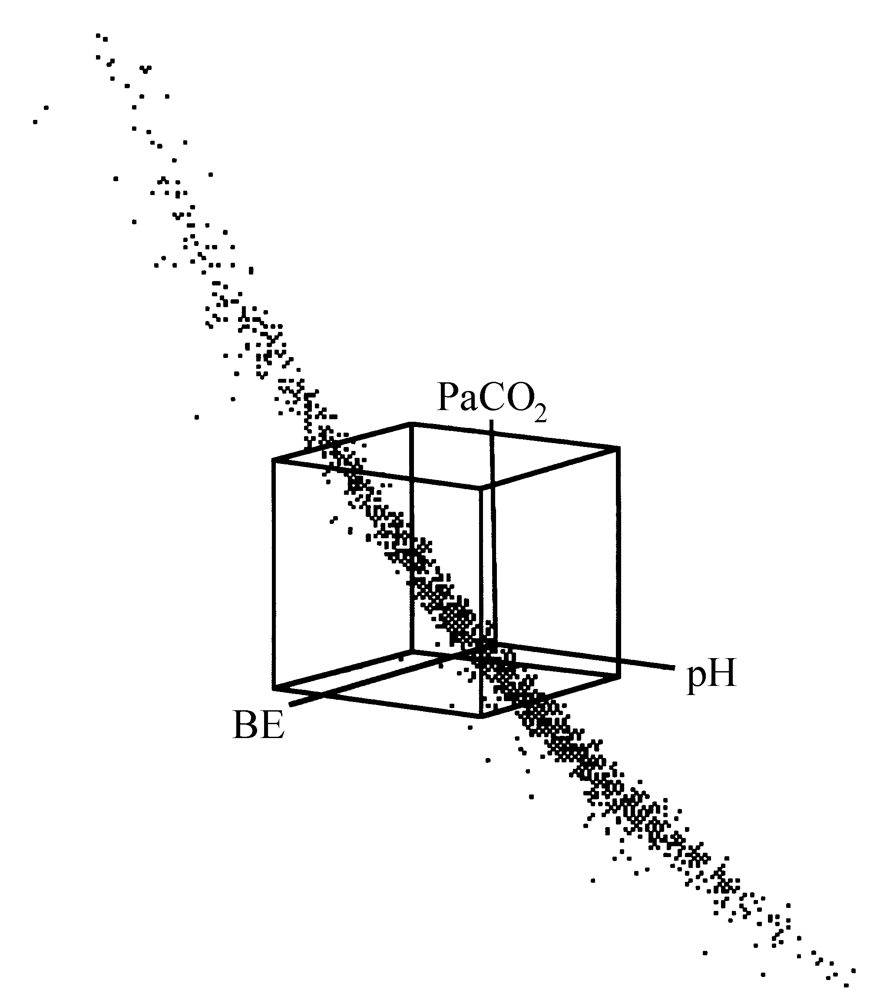
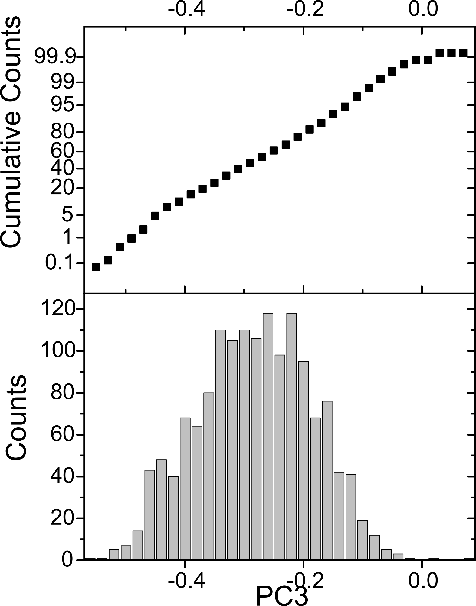
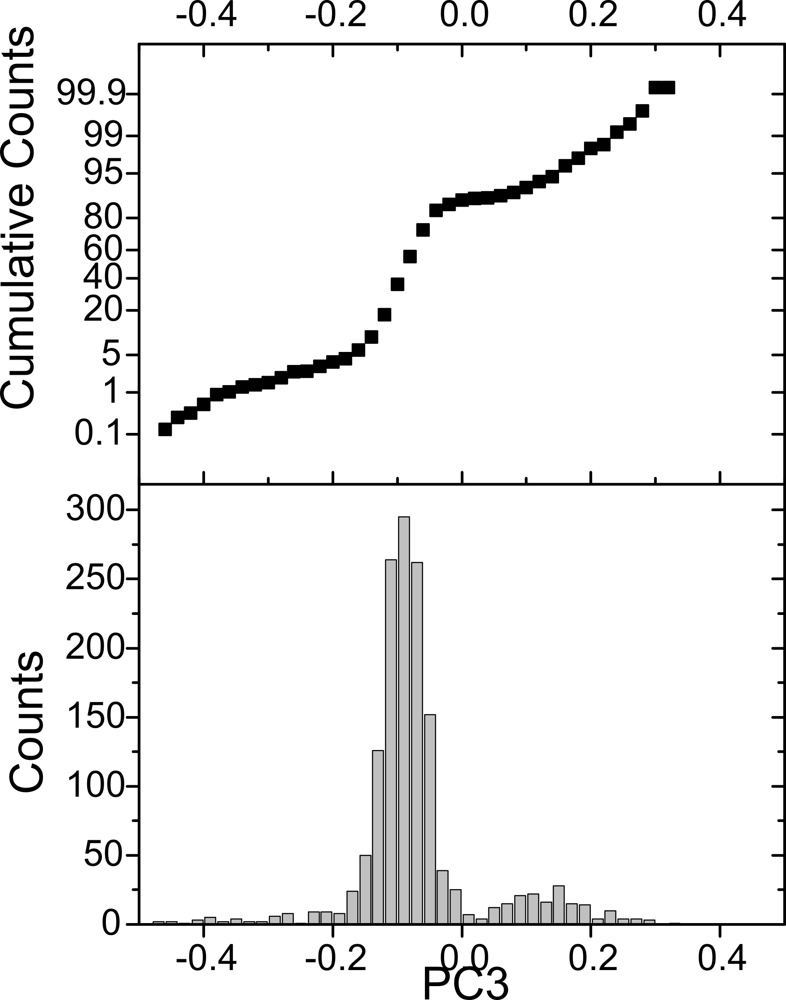

# The application of principal component analysis (PCA) to reduce the dimensionality of trivariate arterial acid-base data distributions

## Introduction

In clinical practice, the interpretation of the arterial acid-base
status is performed by a simultaneous evaluation of three acid-base
laboratory parameters; $\ce{pH}$ of arterial blood, the partial pressure of
carbon dioxide $\ce{CO2}$ in arterial blood ($\ce{PaCO2}$) for the evaluation of
the respiratory component, and either the arterial bicarbonate-ion
($\ce{HCO3-}$) concentration (a$[\ce{HCO3-}]$) or the
base excess ($\ce{BE}$) for the evaluation of the metabolic component \[1, 2\].
Arterial acid-base values, however, are linearly related \[1\]. This
means that if two of the three parameters are known, the third can be
calculated. Thus, clinicians use three acid-base parameters to assess
the acid-base status of a patient as if they were independent of each
other, although only two of the three variables can change
independently.

Although a strict linear relationship is not self-evident for $\ce{pH}$,
$\ce{PaCO2}$ and $\ce{BE}$, an almost linear relationship is also present between
these three variables. This was discovered during an earlier study \[3\]
in which the distributions of large collections of $\ce{pH}$, $\ce{PaCO2}$ and $\ce{BE}$ values were explored, using graphical software with capabilities of
on-line three-dimensional rotation. During these explorations it was
realised that, when plotting the combinations of the three variates as
they occur in practice in three-dimensional space, the points are
located on a surface with only a slight
curvature.

\bcenter

{width="80%"}

\ecenter

*Figure 2--1. Three-dimensional view of a rotated $\mathit{pH}$, $\mathit{PaCO_2}$ and base excess ($\mathit{BE}$) data set. The cube represents the 95% reference volume as defined by the 95% univariate reference intervals of Error: Reference source not found.*

Figure 2 --1 displays such a $\ce{pH}$, $\ce{PaCO2}$ and $\ce{BE}$ distribution in three dimensions. The distribution is rotated in such a way that the curved plane of measurements can be easily viewed. The cube in the middle is the volume in three dimensions that represents the standard reference volume, as built from the three standard univariate 95% reference intervals for $\ce{pH}$, $\ce{PaCO2}$ and $\ce{BE}$ of Table 2--1.

\newpage

*Table 2--1. Means (m) and standard deviations (s) as derived from the standard 95% reference intervals for the arterial acid-base variables. The standard deviations are calculated by assuming the 95% reference intervals to be 4 standard deviations wide.*

 | |95 % reference interval | *m* | *s*
-|-------------------------|-----|----
 | $\ce{pH}$ | 7.35 -- 7.45 | 7.40 | 0.025
 | $\ce{PaCO2}$ (mmHg) | 35 -- 45 | 40 | 2.5
 | $\ce{PaCO2}$ (kPa) | 4.7 -- 6.0 | 5.33 | 0.325
 | $\ce{BE}$ (mmol/l) | -3 -- 3 | 0 | 1.5
 | $[\ce{HCO3-}]$ (mmol/l) | 21 -- 27 | 24 | 1.5
 | log $\ce{PaCO2}$ (mmHg) | log 35 -- log 40 | log 40 | (log 35 -- log 40) / 4
 | log $\ce{PaCO2}$ (kPa) | log 4.7 -- log 6.0 | log 5.33 | (log 4.7 -- log 6.0) / 4
 | log $[\ce{HCO3-}]$ | log 21 -- log 27 | log 24 | (log 21 -- log 27) / 4

Having observed that the relationship between the arterial acid-base
variables (both for combinations of $\ce{pH}$, $\ce{PaCO2}$ and $\ce{BE}$ and $\ce{pH}$, log
$\ce{PaCO2}$ and log a$[\ce{HCO3-}]$) is an almost linear one, the goal is to arrive at a mathematical description of this relationship and to investigate its departure from linearity. The mathematical technique
to be used for such an investigation is a principal component analysis
(PCA). PCA is a multivariate statistical technique for the compression
of large data matrices \[4, 5\]. In this chapter, the results of a PCA
of several distributions of acid-base data, coming from various ICUs,
are described.

## Materials and methods

### Patient data

Six acid-base data sets from four different intensive care units were
submitted to PCA. Data set *AZRbe* contains 1500 unselected combinations
of $\ce{pH}$, $\ce{PaCO2}$ and $\ce{BE}$ values from patients of the respiratory ICU of the
Dijkzigt academic hospital, Rotterdam, The Netherlands. The term
*unselected* means that no specific selection criteria were applied. In
fact, all data sets are constructed by sampling the acid-base data as
consecutively measured in the respective clinical laboratories. Data set
*OLVGbe* contains 1500 unselected combinations of $\ce{pH}$, $\ce{PaCO2}$ and $\ce{BE}$
values from patients of the general ICU of the OLVG hospital, Amsterdam,
The Netherlands. Data set *OLVGab* comprises the 1500 combinations of
$\ce{pH}$, log $\ce{PaCO2}$ and log a$[\ce{HCO3-}]$ values from the same
patients as the *OLVGbe* data set. Data set *SKZbe* contains 1500
combinations of $\ce{pH}$, $\ce{PaCO2}$ and $\ce{BE}$ values from patients of the neonatal
ICU of the Sophia Children's hospital, Rotterdam, The Netherlands. The
data set is composed of equal numbers of data in three age groups:
new-borns younger than five days, infants between five days and one
month of age, and infants aged between one month and one year. Data set
*ELIbe* contains 1500 unselected combinations of $\ce{pH}$, $\ce{PaCO2}$ and $\ce{BE}$
values from the general ICU of the St. Elisabeth hospital, Tilburg, The
Netherlands. Data set *ELIab* comprises the 1500 combinations of $\ce{pH}$, log
$\ce{PaCO2}$ and log a$[\ce{HCO3-}]$ from the same patients as the
*ELIbe* data set.

### Standardisation

Prior to the principal component analysis of an acid-base data set, each
variable in the data set was standardised with fixed means and standard
deviations according to:

$$z_i = \frac{x_i - m}{s},i =  1,...,N$$
(2--1)

where $m$ and $s$ are, respectively, the mean and standard deviation for
the respective acid-base variables as presented in Table 2 --1, while
$N$ is the total number of cases in the data set. The $z_i$ values are
therefore the deviations from the mean $m$ , measured in units of the
corresponding standard deviation $s$.

### Principal component analysis

The standardised data sets were then subjected to PCA. PCA is a
mathematical transformation that enables the reduction of the number of
variables in a multivariate data set whilst preserving as much of the
original information as possible \[4, 5\]. Assuming a multivariate data
set with $p$ variables ($x_1$, $x_2$,\..., $x_p$), PCA finds a new
set of derived variables ($z_1$, $z_2$,\...,$z_p$) that are linear
functions of $x_1$, $x_2$,\..., $x_p$ with the following properties:

- $z_1$ has maximum possible variance among all possible linear
  functions of $x_1$, $x_2$,\..., $x_p$.

- $z_k$ has maximum possible variance among all possible linear
  functions of $x_1$, $x_2$,\...,$x_p$, subject to $z_k$ being
  uncorrelated with $z_1$, $z_2$,\...$z_{k-1}$, for $2 \le k \le p$
  \[4\].

The derived variables $z_1$, $z_2$,\...,$z_p$ are called the
principal components or PCs.

In linear algebraic terms, PCs are determined with an eigenvalue
transformation of the variance-covariance matrix as derived from the
multivariate data set. For a set of $N$ vectors $\bf x_i$ $(i= 1,...,N)$  in a $p$-dimensional data set, the variance-covariance
matrix $V$ is defined as:

$$V = \frac{\sum\limits_{i = 1}^{N}{(\bf x_i - \bf m)(\bf x_i - \bf m)^{T}}}{N(N - 1)}$$
(2--2)

where $\bf m$ is the vector of the mean of the set $\bf{x_i}$ $(i= 1,...,N)$ and the superscript $T$ indicates transposition
of a vector, in the convention that an untransposed vector is a column
vector. The eigenvalue transformation yields a transformation matrix $U$,
which transforms the original vectors $\bf m$ into vectors $\bf y$,
according to $\bf y =$ $U$ $\bf x$, such that the variance-covariance matrix $W = UVU^T$ of the transformed vectors $\bf y$ is a diagonal matrix. If $U$ is
constrained to be a unitary matrix, the component variances of the
transformed vectors $\bf y$ appear as eigenvalues ($\lambda$) in the analysis and
are found as the diagonal elements of $W$.

Since the eigenvalue transformation diagonalises the variance-covariance
matrix, the total variance in the set of original vectors $\bf x$ is
decomposed into $p$ orthogonal directions. Thus, for a set of
$p$-dimensional vectors $\bf x$ for which it is observed that most of the
variance is confined to a subspace of dimension $l < p$, it is
expected that the components 1 through $l$ of the transformed vectors
$\bf y$ contain most of the useful information. The components $l +1$
through $p$ have only a small variance, and thus convey (almost) no
information. In the present situation, $p = 3$ and due to the (almost)
linear relationships between the variables in the standardised data
sets, it is expected that $l = 2$.

## Results

Table 2 --2 presents the results of the principal component analysis of
each data set. The eigenvalues $\lambda$ are shown for each of the three
principal components (hereafter referred to as PC1, PC2 and PC3). The
eigenvalues $\lambda$ explain the contribution of each of the principal
component to the total variance in the data set prior to PCA. For
instance, in the *AZRbe* data set, PC1, PC2 and PC3 explain 62.37%,
36.91% and 0.71% of the total variance in the initial data set,
respectively. From Table 2 --2 it can be concluded that for each data
set, the percentage of variance explained by the third principal
component (PC3) is only small compared to the variance explained by the
first two principal components (PC1 and PC2) together. The explained
variance by PC1 and PC2 for each data set is more than 99%. The data
sets *OLVGab* and *ELIab* show the smallest explained variance by PC3;
0.03% and 0.09%, respectively. This is not surprising since these data
sets consist of $\ce{pH}$, log $\ce{PaCO2}$ and log a$[\ce{HCO3-}]$ values
and these variables are linearly related according to the
Henderson-Hasselbalch equation (see Chapter Error: Reference source not
found) \[1\].

*Table 2--2. Eigenvalues $\lambda$ and contributions to the total variance in the initial data set (in brackets) for each principal component.*

 | |PC1 | PC2 | PC3
-|-----|-----|----
 | AZRbe | 20.54 (62.37%) | 12.16 (36.91%) | 0.235 (0.71%)
 | OLVGbe | 26.04 (69.70%) | 11.22 (30.03%) | 0.101 (0.27%)
 | OLVGab | 25.52 (74.30%) | 8.82 (25.67%) | 0.009 (0.03%)
 | SKZbe | 21.09 (78.01%) | 5.87 (21.72%) | 0.072 (0.27%)
 | ELIbe | 23.62 (64.55%) | 12.83 (35.07%) | 0.137 (0.37%)
 | ELIab | 20.36 (58.91%) | 14.17 (41.00%) | 0.032 (0.09%)

For each data set, a matrix $U$ can be built from the three separate
normalised eigenvectors $\varepsilon$, which are used to calculate the associated
principal component values from a combination of standardised original
acid-base values. Table 2 --3 shows the normalised eigenvectors $\varepsilon$ of
each principal component for all data sets. With the matrices U, new
trivariate distributions of principal component values were calculated
from the original standardised acid-base data sets.

\newpage

\blandscape

*Table 2--3. Normalised eigenvectors $\varepsilon$ of each principal component as obtained after PCA. The eigenvectors for PC1, PC2 and PC3 are columns 1, 2 and 3, respectively of the eigenmatrix matrix $U$. The eigenmatrix $U$ will be the input of calculations to be presented in the next chapters.*

 | |PC1 | PC2 | PC3
-|-----|-----|----
 | AZRbe | (0.297, -0.885, -0.358) | (0.709, -0.046, 0.703) | (0.639, 0.463, -0.614)
 | OLVGbe | (-0.039, -0.777, -0.628) | (0.742, -0.444, 0.503) | (0.669, 0.446, -0.594)
 | OLVGab | (0.044, 0.686, 0.727) | (-0.839, 0.420, -0.346) | (0.542, 0.594, -0.594)
 | SKZbe | (0.635, -0.757, 0.153) | (0.425, 0.508, 0.749) | (0.645, 0.411, -0.649)
 | ELIbe | (0.732, -0.184, 0.656) | (-0.184, 0.874, 0.450) | (0.656, 0.450, -0.605)
 | ELIab | (0.734, -0.012, 0.679) | (-0.391, 0.811, 0.436) | (0.556, 0.585, -0.590)

\elandscape

Table 2 --4 presents the characteristics of the resulting principal
component value distributions. For each data set, the standard deviation
of the PC3 distribution is small compared to the standard deviations of
the PC1 and PC2 distributions. Data set *OLVGab* and *ELIab* have the
smallest standard deviations for the third principal component value
distribution: 0.097 and 0.178, respectively. This is in accordance with
the results presented in Table 2 --2.

Since for each data set the amount of explained variance is more than
99% when only PC1 and PC2 are considered, there is no significant loss
of information when the acid-base values are projected onto the plane
spanned by PC1 and PC2. Hence, any quantitative analysis based on PC1
and PC2 addresses the complete acid-base status. In Figure 2 --2,
scatterplots of PC2 versus PC1 are shown for all data sets.

Since the plane of measurements in case of a $\ce{pH}$, $\ce{PaCO2}$ and $\ce{BE}$ data set
is slightly curved (see Figure 2 --1), it is interesting to investigate
the effect of the curvature on the distribution of PC3 values.
Therefore, the PC3 distribution characteristics of two data sets were
investigated. This was done by constructing box-whisker plots of groups
of PC3 values that are increasingly further away from the bivariate
PC1-PC2 mean. As a cut-off point, a distance of 1 standard deviation
score was chosen with a maximum of 10, yielding 11 groups of data. A
box-whisker plot provides a graphical representation of the distribution
of values in a given data set. The outer top and bottom horizontal lines
of the box-whisker plots indicate the $95^{th}$ and $5^{th}$ percentiles of a
distribution, respectively. The top and bottom horizontal lines
enclosing the box denote the $75^{th}$ and the $25^{th}$ percentile,
respectively. The horizontal line inside the box denotes the
median.

\bcenter

{width="75%"} \

\ecenter

*Figure 2--3. Box-whisker plots as a function of the distance from the
mean in the PC1-PC2 plane for data set OLVGbe. SDS stands for 'standard
deviation score'.*

\bcenter

{width="75%"} \

\ecenter

*Figure 2--4. Box-whisker plots as a function of the distance from the mean in the PC1-PC2 plane for data set OLVGab.*

Figure 2 --3 shows the box-whisker plots for the *OLVGbe* data set. In
Figure 2 --4 the box-whisker plots are shown for the *OLVGab* data set.
Comparing both figures, it is apparent that with increasing distance
from the mean in the plane spanned by the first two principal components
PC1 and PC2, the variance in the PC3 distribution increases for data set
*OLVGbe*, while the variance in the PC3 distribution of data set
*OLVGab* remains the same for all distance strata. These figures
illustrate the slight curvature of a PCA transformed $\ce{pH}$, $\ce{PaCO2}$ and $\ce{BE}$ data set which is absent in a PCA transformed $\ce{pH}$, log PaCO2 and log
a$[\ce{HCO3-}]$ dataset.

<!-- {width="6.495138888888889in"
height="3.1020833333333333in"} -->

Figure 2 --5 presents a histogram of the 1500 calculated PC3 values of
the transformed *OLVGab* distribution. The straight line in the normal
probability plot in the upper part of Figure 2 --5 indicates that the
1500 PC3 values are normally distributed. This was confirmed with a
Kolmogorov-Smirnov distribution fit test ($D_{max}$ of 0.03 with a
$p$-value of 0.118). Since these PC3 values are normally distributed, a
parametric 95% reference interval may be derived from this distribution
as $m \pm 2s$, resulting in a reference range of -0.472 to -0.092. The
calculated PC3 value of a $\ce{pH}$, log $\ce{PaCO2}$, log a$[\ce{HCO3-}]$
combination from an ICU patient of the OLVG hospital, transformed with
the corresponding eigenvectors of Table 2 --3, will have a probability
of 95% of being located within this interval. A similar analysis,
however, on the 1500 PC3 values of the transformed data set *ELIab*
showed a bimodal distribution of PC3 values (Figure 2 --6).
Consequently, the distribution was found to be significantly deviating
from a normal distribution ($D_{max}$  of 0.263 with a $p$-value < 0.01).

\bcenter

{width="75%"} \

\ecenter

*Figure 2--5. Histogram and normal probability plot of the 1500 third principal component values (PC3) of the OLVGab data set.*

\bcenter

{width="75%"} \

\ecenter

*Figure 2--6. Histogram and normal probability plot of the 1500 third principal component values (PC3) of the ELIab data set.*

## Discussion

In 1979, Madias *et al*. \[6\] already noted that, when evaluating an
acid-base status, it is illogical and fundamentally wrong to use $\ce{pH}$,
$\ce{PaCO2}$ as well as a$[\ce{HCO3-}]$, while only two of these
three variables are free to change independently. He proposed to
evaluate acid-base disorders with only two of the three basic acid-base
variables. This means, however, that clinicians are deprived of one of
the three variables on which the interpretation of the acid-base status
is traditionally based.
In this chapter, a solution is proposed that allows a quantitative
analysis of all three basic acid-base variables while being faithful to
the interdependence between them. A multivariate statistical technique
called principal component analysis (PCA) was used to reduce the
dimensionality of large trivariate distributions of acid-base variables.
Results show that the acid-base status can be faithfully represented in
a principal component subspace defined by the principal components PC1
and PC2, without significant loss of information. The distortion,
measured as a percentage of variance not represented, is shown to be
less than 0.7% for all the data sets investigated. The (small)
percentage of explained variance by PC3 in data sets of $\ce{pH}$, log $\ce{PaCO2}$
and log a$[\ce{HCO3-}]$ (data sets *OLVGab* and *ELIab*) may
be attributed to rounding effects and analytical imprecision. For the
other data sets, consisting of $\ce{pH}$, $\ce{PaCO2}$ and $\ce{BE}$ values, the curvature
of the plane of measurements is an extra source of variance resulting in
larger percentages of variance explained by PC3. However, this source of
variance is only minor and for each data set it is therefore justified
that quantitative analyses of acid-base disorders be based on PC1 and
PC2 values after a PCA transformation, rather than on the original
acid-base values. Furthermore, projection of the original points onto
the PC1-PC2 subspace is (almost) distortionless. In Chapter Error:
Reference source not found, this characteristic is used to define a
sound way to graphically represent all three acid-base variables in a
single two-dimensional
representation.

<!-- {width="5.785416666666666in"
height="4.3284722222222225in"} -->

The minor variance in PC3 may also serve as a plausibility check for
acid-base laboratory values; each transformed combination of $\ce{pH}$, $\ce{PaCO2}$
and a$[\ce{HCO3-}]$/$\ce{BE}$ must lead to a small PC3 value. For a
$\ce{pH}$, log $\ce{PaCO2}$ and log a$[\ce{HCO3-}]$ data set, PC3 must be
within the 95% reference interval for PC3 as obtained from the PC3
values after PCA of an acid-base data set. For instance, the 95%
reference interval for PC3 of the *OLVGab* data set was found to be
-0.472 to 0.092. If a transformed combination of acid-base measurements
is not within the interval, then it may be concluded that this specific
combination of $\ce{pH}$, $\ce{PaCO2}$ and a$[\ce{HCO3-}]$ is not valid.
Note that the interval is not equally centred around zero. From the
definition of PCA one would expect that, when calculated means and
standard deviations are used, the mean value for all principal component
values would be zero. However, for the standardisation procedure the
fixed means and standard deviations of Table 2 --1 were used, leading to
the observation that the mean values of the principal components are
different from 0 for the various data sets, since they have different
means and variances for the original acid-base values.

Checking whether the PC3 value of a transformed acid-base observation is
within the 95% reference interval is only possible for data sets of $\ce{pH}$, log $\ce{PaCO2}$ and log a$[\ce{HCO3-}]$, since the variance in PC3
is independent of the distance of an observation to the PC1-PC2
bivariate mean (see Figure 2 --6). Observations in a data set of $\ce{pH}$,
$\ce{PaCO2}$ and $\ce{BE}$ are located on a slightly curved plane of measurements, resulting in the effect that with increasing distances from the PC1-PC2 bivariate mean, the variance in PC3 increases (see Figure 2 --3). To check the plausibility of a transformed $\ce{pH}$, $\ce{PaCO2}$ and $\ce{BE}$ combination one could either use the variance in PC3 as found for data with distances larger than or equal to 10 standard deviations scores ($\ge 10$), or use the variance in PC3 in the associated distance group.

One could argue that the relationship between the acid-base variables
could be described by studying the formula used in acid-base analysers
to calculate a$[\ce{HCO3-}]$ or $\ce{BE}$ from measured $\ce{pH}$, $\ce{PaCO2}$
and haemoglobin. The advantage of the approach presented in this
chapter, however, is that no prior knowledge is needed about the formula
with which the a$[\ce{HCO3-}]$ or the $\ce{BE}$ are calculated. The
method, therefore, adapts itself to the instruments used.

## Acknowledgements

I am indebted to dr. R.N.M. Weijers and dr. D. Zandstra for making the
data sets *OLVGbe* and *OLVGab* available. Dr. B. van der Berg and dr.
R.W. Wulkan contributed similar material: the data sets *AZRbe* and
*SKZbe*, respectively. Finally, dr. J.E. van Puyenbroek and dr. B.
Speelberg provided the data sets *ELIbe* and *ELIab*.

## References

1\. Rose BD. Clinical Physiology of Acid-Base and Electrolyte Disorders.
4th Edition, New York: McGraw-Hill, Inc., 1994; 853.2.\
2\. Astrup P,
Jörgensen K, Siggaard-Andersen O, et al. The acid-base metabolism, a new
approach. *Lancet* 1960;1035-1039.3.\
3\. Gelsema ES, Leijnse B, Wulkan RW. A
multi-dimensional analysis of three chemical quantities in the blood.
*Med Inform* 1991; 16:43-54.4.\
4\. Jolliffe IT, Morgan BJT. Principal
component analysis and exploratory factor analysis. *Stat Meth Med Res*
1992; 1:69-95.5.\
5\. Jolliffe IT. Principal Component Analysis. New York:
Springer-Verlag, 1986, *Springer Series in Statistics*; vol 12.6.\
6\. Madias
NE, Adroqué HJ, Horowitz GL, et al. A redefinition of normal acid-base
equilibrium in man: Carbon dioxide tension as a key determinant of
normal plasma bicarbonate concentration. *Kidney Int* 1979; 16:612-618.
