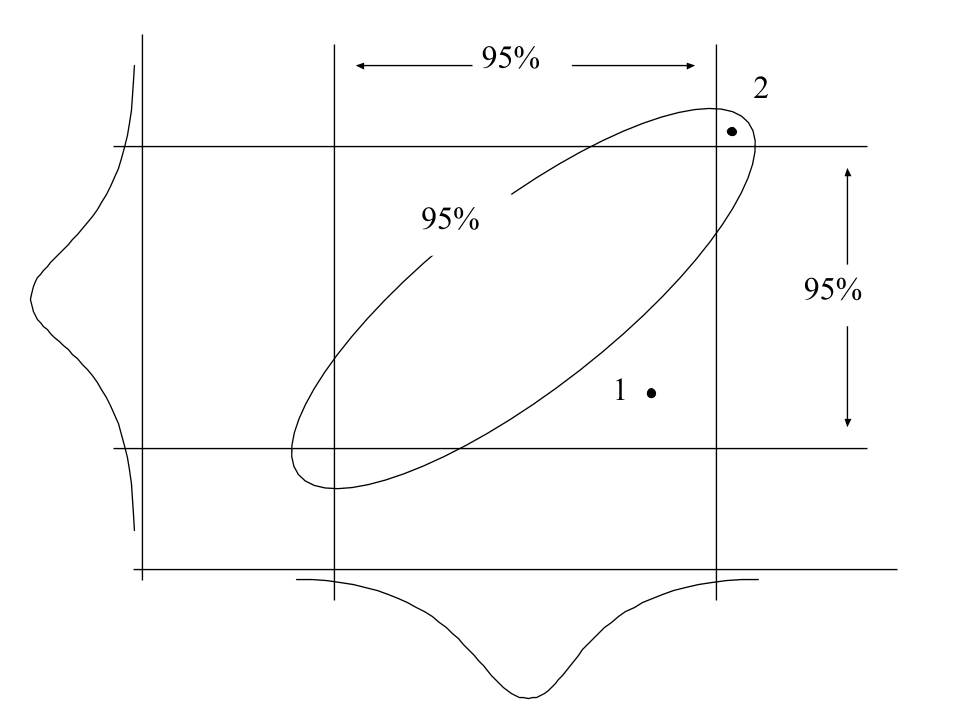
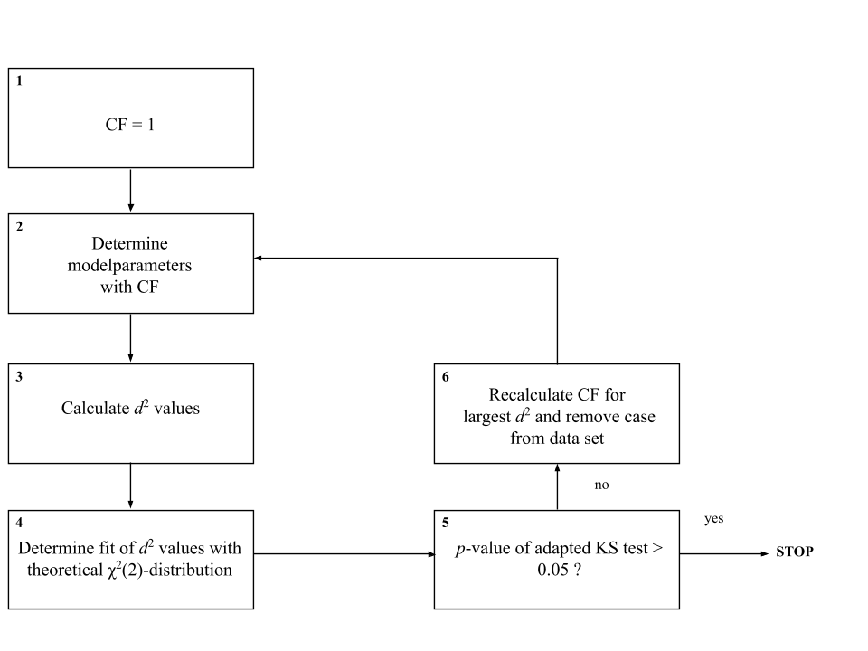

# The construction of patient-based bivariate reference models from trivariate arterial acid-base data distributions

\vspace*{3cm}

Marcel Hekking, Edzard S. Gelsema, Jan Lindemans

\vspace*{5cm}

Parts are published in: Clinical Biochemistry 1995; 6:581--585

## Introduction

A central question in clinical chemistry is 'Is the observed laboratory
value for this person acceptable or not?'. The standard procedure for
answering this question is to compare the observed laboratory value with
a relevant univariate reference interval for that particular analyte
\[1-3\]. The univariate reference interval has served for years as a
standard for the judgement of 'normalcy' of laboratory values \[4\].
Many different approaches exist to determine a univariate reference
interval \[5-7\]. In general, a reference interval is constructed by
taking a random sample from a specific (often healthy) reference
population. New observed values are then compared with the values of the
sample. Obviously, if the observed value is clearly not within the range
of the sample values then one can safely assume the observed value to be
abnormal with respect to the chosen reference population. However, with
observed values coming closer to the range of values in the sample,
there has to be some decision point as whether to consider the observed
value to be typical for the reference population or not. This decision
point has been arbitrarily set at 5%; when a decision is made one
accepts a 5% probability of erroneously classifying an observed value as
not typical for the chosen reference population (in hypothesis testing
known as a type I error) \[8\]. It has been shown that, in case the
values of the sample follow a normal (or Gaussian) distribution, a
parametric reference interval may be constructed by taking 2 standard
deviations around the mean of the sample.

With respect to the statistical determination and the application of 95%
univariate reference intervals for arterial pH, $\ce{PaCO2}$,
a$[\ce{HCO}_{3}^-]$ and BE on an intensive care department, the
following problems exist.

First, there is no clear consensus about how to define a useful
reference population. If a population of healthy persons is taken as a
reference population, reference intervals may be too narrow to be of
practical use in clinical situations. Moreover, for quantities that are
obtained by invasive procedures, the use of healthy volunteers may be
ethically unsound \[9\].

A second problem stems from the intrinsic two-dimensionality of a
trivariate arterial acid-base data set. The relationship between pH,
logarithmic $\ce{PaCO2}$ and logarithmic a$[\ce{HCO}_{3}^-]$, as
described by the Henderson-Hasselbalch equation, is linear and even the
relationship between pH, $\ce{PaCO2}$ and BE is a nearly linear one (see
preceding chapters). Accordingly, it is unnecessary and illogical to use
reference intervals for all three acid-base variables, since only two of
the three can change independently \[10\].

Thirdly, there are problems concerning the selection of the proper
statistical model. The use of the parametric univariate 95% reference
interval as the statistical model for evaluating laboratory values is
well established in clinical chemistry \[2\]. However, already in 1969,
Schoen and Brooks \[11\] reported a statistical dilemma resulting from
the use of multiple 95% reference intervals. A person, evaluated with a
single 95% reference interval has an *a priori* probability of 5% of
being incorrectly diagnosed as abnormal. The same person evaluated with
10 such 95% reference intervals for 10 independent analytes will have an
*a priori* probability of 40% (1-0.95^10^ = 0.4) for being incorrectly
diagnosed as abnormal for one or more intervals. Hence, in situations of
a simultaneous interpretation of multiple variables, the use of single
95% reference intervals results in an increase in the number of false
positive observations by chance alone \[12\]. One way to deal with this
dilemma is to automatically adjust the reference intervals in case of
multiple variables in such a way that the probability of falling within
all univariate reference intervals remains 95% (Bonferroni adjustment)
\[13, 14\]. Another option is the use of the multivariate reference
model \[7, 14-19\].

The essence of a multivariate reference model is that it treats two or
more univariate distributions as one joint multivariate distribution
rather than separate distributions. Figure 4--1 displays such a joint
distribution for two hypothetical standard univariate distributions.
Both univariate distributions are Gaussian, as illustrated by their
bell-shaped curves. The joint distribution of both marginal
distributions is the bell-shaped 'mountain' in the middle. Univariate
reference intervals are obtained by making horizontal cross-section of
the marginal distributions at the 5% probability density level. At the
bottom the resultant squared reference region can be found. A
cross-section of the multivariate distribution at the 5% probability
level, however, results in an elliptical reference region. In analogy to
the univariate case, an observation falling outside this ellipse has an
*a priori* probability of 5% of being incorrectly diagnosed as
abnormal.

\bcenter

{width="95%"}

\ecenter

_Figure 4--1. The joint distribution of two hypothetical standard normal univariate distributions. The correlation coefficient r between both variables has been set to 0.8. Projections of horizontal cross-sections at the 5% probability density level yield two types of reference regions: the square and the ellipse. Differences between these regions are explained further in Figure 4--2._

The major advantage of using a multivariate reference region as the true
reference region rather than the region enclosed by the two univariate
reference intervals is that it takes into account possible correlations
between the variables. This is illustrated in Figure 4--2. The
rectangle represents the reference region when using both univariate
reference intervals. If the ellipse is taken as the standard, false
positive and false negative observations may occur. For instance,
observation 1 falls within both univariate intervals and is therefore
normal for both variables separately. The combination of the two,
however, is far from normal due to the positive correlation between the
variables. On the other hand, observation 2 is abnormal for both
univariate variables but is indeed normal if the correlation between the
variables is taken into account. These effects become stronger as the
correlation between the variables increases but are present even if the
variates involved are uncorrelated \[20\].

\bcenter

{width="75%"}

\ecenter

_Figure 4--2. Discrepancy between a multiple univariate reference region and a single multivariate reference region. Plotted horizontally and vertically are the probability densities of analyte 1 and 2 of Figure 4--1, respectively. Using the region enclosed by the two univariate reference intervals as a reference region, observations 1 and 2 are a false negative and a false positive observation, respectively when the 95% reference ellipse is taken as the standard \[7, 20\]._

In this chapter, a method for deriving reference models for arterial
acid-base data is presented that addresses all of the problems discussed
above. A method is proposed that calculates multivariate reference
models from laboratory values of intensive care patients themselves.
Intensive care patients rather than healthy individuals are therefore
the reference population. Moreover, in concordance with the observed
linearity between the arterial acid-base parameters, multivariate models
are built on the first two rotated principal component values as
calculated with the techniques described in the preceding
chapters.

## Materials and methods

### Patient data

For the analyses, the data sets presented in Chapter Error: Reference
source not found were used; *AZRbe*, *OLVGbe*, *OLVGab*, *SKZbe*,
*ELIbe* and *ELIab*. For each data set, the transformation matrix T was
determined according to the descriptions in the preceding chapter. Each
case in the original data set was then transformed with the
transformation matrix T yielding new data sets of rotated principal
component values PC1\', PC2\' and PC3\'. The bivariate distributions of
PC1\' and PC2\' are the input for the calculations presented below.

### The multivariate reference model

The multivariate reference model is defined as follows. Assuming a
theoretical multivariate Gaussian distribution with a known mean vector
and variance-covariance matrix (**μ**,Σ) the squared Mahalanobis
distances between a vector **x** and the mean **μ**:

*d*^2^ = (**x** - **μ**)[^t^]{.smallcaps} Σ^-1^ (**x** - **μ**) (4--1)

are χ^2^(*k*)-distributed where *k* is the dimensionality of the
multivariate model \[21\]. The superscript [t]{.smallcaps} stands for
the transposition of a column-vector to a row-vector, **x** is the
observation vector and Σ^-1^ is the inverse of the variance-covariance
matrix. The mean vector **μ** and the variance-covariance matrix Σ are
called the model parameters. The 95% multivariate reference region
includes all cases **x** with a *d*^2^smaller than or equal to the 0.95
fractile of a χ^2^(*k*)-distribution \[22\]. In practice, the model
parameters are unknown and replaced by the sample estimates **m** and S,
respectively.

To correct for the uncertainty in the sample estimates of the mean
vector **m** and the variance-covariance matrix S when evaluating single
multivariate observations, Chew and Albert proposed to use a 0.95
cut-off fractile that is based on the *F*-distribution \[17, 23\];

*C* = *k*(*N*2 − 1) *F*(0.95;*k*,*N* − *k*) / *N*(*N* − *k*) (4--2)

where *k* is the number of variables in the analysis, *N* is the number
of cases and *F*(0.95;*k*,*N* - *k*) is the 0.95 fractile of the
*F*-distribution for *k* and *N* - *k* degrees of freedom. In
geometrical terms, 0.95 fractiles delimit specific regions in
*k*-dimensional space and are known as 95% equal probability ellipses
(for *k* = 2) or 95% equal probability ellipsoids (for *k* \> 2). The
region delimited by *C* is also known as the 95% prediction region
\[17\].

### Finding the Gaussian distributed core in a multivariate patient data set

In this section, an iterative trimming procedure is described for the
determination of a valid acid-base bivariate 95% prediction region from
the PC1\' and PC2\' values of an ICU patient data distribution. The
method assumes that the patient data distribution is composed of two
sorts of data; 1) a bivariate Gaussian distributed part of observations
at the centre of the distribution (hereafter called the background model
distribution) and 2) a contaminating part of outliers in the outer
regions of the distribution. The method aims at finding the background
model distribution by subsequently removing aberrant observations from
the outer regions of the bivariate distribution until the remaining
trimmed distribution is found to be bivariate Gaussian.

Under the assumption that the remaining observations of a trimmed
bivariate distribution belong to a wider bivariate Gaussian
distribution, the standard deviations of the marginal distributions of
this wider bivariate Gaussian distribution can be approximated by the
standard deviations of the trimmed distributions. However, clearly,
these approximations are underestimates. Therefore, prior to the
construction of the variance-covariance matrix from estimated marginal
standard deviations, a correction must be performed. A table with
standard deviation correction factors was constructed empirically
beforehand as follows. A standard bivariate Gaussian distribution of
6000 cases was generated from two standard univariate Gaussian
distributions (mean = 0 and standard deviation = 1) with the use of the
SPSS statistical software package (SPSS for Windows release 6.0,
Chicago). The resultant bivariate distribution was then trimmed at
specific χ^2^(2) fractiles. At each χ^2^ cut-off fractile, the
correction factor was determined by dividing the standard deviation of
the original marginal distribution by the standard deviation of the
trimmed distribution. In **Figure 4--3**, correction factors (CF) are
plotted for 24 fixed χ^2^ cut-off fractiles.

\bcenter

{width="50%"}

\ecenter

_Figure 4--3. The standard deviation correction factor (CF) at 24 specific χ^2^ cut-off fractiles for a bivariate Gaussian distribution._

Trimming the bivariate distribution now proceeds as follows (see also
Figure 4--4).

1\) In the first iteration on the untrimmed bivariate distribution, no
cases are removed and the correction factor (CF) is therefore set to 1.

2\) The model parameters (mean vector and variance-covariance matrix)
are constructed from the estimated means, corrected standard deviations
and estimated correlation coefficient.

\bcenter

{width="95%"}

\ecenter

_Figure 4--4. Flow-chart of trimming procedure to determine the background model parameters in a bivariate distribution of patient data. CF is the correction factor for the estimated standard deviations and KS stands for the size-adjusted Kolmogorov-Smirnov test. See text for further explanation._

3\) With the estimated model parameters, a *d*^2^value (Equation 4--1)
is calculated for each case in the data set.

4\) The goodness-of-fit of the observed cumulative probability
distribution of *d*^2^values with the theoretical cumulative χ^2^(2)
probability distribution is now determined. In a bivariate Gaussian
distribution, the *d*^2^values are distributed according to a
χ^2^-distribution with 2 degrees of freedom \[17, 18, 24, 25\]. This
observation is used to verify the bivariate Gaussian assumption. With a
1-dimensional goodness-of-fit test like the Kolmogorov-Smirnov (KS) test
it can be tested whether the calculated *d*^2^ values indeed follow a
χ^2^(2)-distribution \[24\]. The test statistic of the KS test is the
largest difference in probability between an observed cumulative
probability distribution and a specific theoretical cumulative
probability distribution \[25\]. If the KS test statistic is small
enough, the hypothesis of the bivariate distribution being Gaussian is
assumed to be verified.

However, the KS test is designed to be used in non-trimmed distributions
only and an adaptation of the test was necessary. Under the assumption
that the remaining cases of a trimmed bivariate distribution are part of
a wider bivariate Gaussian distribution, the number of cases in this
wider bivariate Gaussian distribution can be reconstructed for a given
*d*^2^trimming value. Thus, for a ranked array of *d*^2^values
(*d~1~*,\..., *d~N~*) of a trimmed distribution, the adapted KS test
statistic D~max~ is defined as:

> D^+^ = max(*i*/(*N*/*Pd~N~*) − *Pd~i~*), (*i* = 1,\..., *N*), (4--3)\
> D^−^= max(*Pd~i~* − (*i −* 1)/(*N*/*Pd~N~*)), (*i* = 1,\..., *N*),
> D~max~ = max(D^+^, D^−^),

where *Pd~i~* is the theoretical cumulative χ^2^(2) probability for
*d~i~*, *Pd~N~* is the cumulative theoretical χ^2^(2) probability for
*d~N~* and consequently *N*/*Pd~N~* is the estimated number of cases in
the wider untrimmed bivariate Gaussian distribution. The *p*-value for a
size-adjusted KS test statistic \*D~max~ (D~max~ × (√*N* − 0.01 +
0.85/√*N*)) in the range of 0.01-0.15 can be calculated as \[26\]:

*p-*value = 6.18 − 17.53 × \*D~max~ + 16.75 × \*D~max~ ^2^ − 5.39 ×
\*D~max~^3^ (4--4)

5\) If the adapted KS test yields a *p*-value larger than α = 0.05,
there is not enough evidence to reject the H~o~-hypothesis of fit. It
may then be concluded that the trimmed distribution is indeed part of a
wider bivariate Gaussian distribution and the procedure is stopped. The
estimated model parameters (mean vector **m** and variance-covariance
matrix S as built from the corrected standard deviations and the
estimated correlation coefficient) are now the background model
parameters and can be used to define bivariate reference regions.

6\) If the adapted KS test yields a *p*-value smaller than or equal to α
= 0.05, the H~o~-hypothesis of fit is rejected and the H~a~-hypothesis
(lack of fit) is accepted. This means that the trimmed bivariate
distribution is not part of a wider bivariate Gaussian distribution and
the case with the largest *d*^2^value is removed from the data set. A
correction factor (CF) corresponding to this *d*^2^value is calculated
and a new iteration starts with the trimmed distribution and the new
correction factor.

## Results

For each data set, the trimming procedure described in the preceding
section succeeded in establishing the background model parameters.
Results can be found in Table 4--1. In Figure 4--5, the cumulative
probability plot of the *d*^2^-values of the *ELIbe* data set can be
found as an example of the trimming procedure. Note that the remaining
cases of the trimmed data set (thick line) follow the theoretical
cumulative χ^2^(2) probability distribution (thin line). The
corresponding adapted size-adjusted KS test-statistic is 0.855 with an
associated *p*-value of 0.072. Hence, the conclusion can be drawn that
the cases of this trimmed data set are part of a wider bivariate
Gaussian distribution.

From the means (*m*), standard deviations (*s*) and correlation
coefficients (*r*) presented in **Table 4--1**, the final background
model parameters for each data set can be constructed. With the
background model parameters, 95% and 30% equal probability ellipses were
constructed for each data set and displayed in their respective
tri-axial charts (Figure 4--6 to Figure 4--11). The differences
between the corrected 0.95 and 0.30 fractiles (Equation 4--2) for the
*ELIbe* data set (respectively 6.01 and 0.714) and the actual 0.95 and
0.30 χ^2^(2) fractiles (respectively 5.99 and 0.713) are only small.
Since the number of trimmed cases in this data set is the largest of all
data sets (382 cases), differences between corrected and actual
fractiles will be even smaller for other data sets. Therefore, equal
probability ellipses for each data set are based on the true χ^2^(2)
fractiles rather than on their corrections.

Compared to the standard univariate reference region (the hexagon shaped
figure) the 95% equal probability ellipses (outer ellipses) are
relatively large. The location and orientation of the ellipses for the
data sets *ELIbe* (Figure 4--6) and *OLVGbe* (Figure 4--7) are
comparable. Their 30% equal probability ellipses both cover almost the
entire standard univariate reference region. Both data sets come from a
general ICU of a non-academic hospital. However, the ellipses of the
*AZRbe* data set (Figure 4--8) are shifted towards a region with higher
pH values and lower $\ce{PaCO2}$ values. The correlation coefficient *r*
between PC1\' and PC2\' is -0.20 (see Table 4--1). Location and shape
of the ellipses of the *AZRbe* data set indicate that a large portion of
the acid-base data from this data set is indicative for a respiratory
alkalosis. The *AZRbe* data set comes from the respiratory ICU of the
academic hospital Dijkzigt. In Figure 4--9, the ellipses of the
neonatal ICU of the Sophia Children's hospital can be found. With
respect to the hexagon in this figure and other data sets, the ellipses
are shifted towards lower pH values, higher $\ce{PaCO2}$ values and lower BE
values. This area is associated with combined respiratory and metabolic
acidoses. Moreover, most of the variation in the data set is caused by
variation in $\ce{PaCO2}$ values rather than BE values. This can be easily
appreciated by (mentally) projecting the ellipses onto the $\ce{PaCO2}$ and
BE axis, respectively. The projected ellipses would cover a much larger
area on the $\ce{PaCO2}$ axis than on the BE axis.

\bcenter

{width="60%"}

\ecenter

_Figure 4--5. Fit of the observed cumulative probabilities of the remaining d*^2^*values of the trimmed ELIbe data set (thick line) with the theoretical cumulative χ*^2^*(2) probability distribution (thin line). P is the cumulative probability. \*D~max~ is the test statistic of the adapted and size-adjusted Kolmogorov-Smirnov test, indicating the degree of fit of the d*^2^*values with the theoretical distribution. In this case there is not enough evidence (p \> 0.05) to reject the H~o~-hypothesis of fit._

For the models based on the actual bicarbonate concentration (Figure 4
--10 and **Figure 4--11**), it can be seen that the equal probability
ellipses are also very wide but centred around the origin of the chart.

\bcenter

{width="65%"}

\ecenter

_Figure 4--6. The 30% equal probability ellipse (inner ellipse) and the 95% equal probability ellipse (outer ellipse) for the ELIbe data set._

## Discussion

In this chapter, an iterative method is described for the determination
of bivariate reference models for acid-base variables, based on values
coming from intensive care patients themselves. The proposed method
closely resembles the iterative method described by Gelsema *et al.* for
defining multivariate reference models from patient data \[27\]. In this
method, the background model parameters are estimated by iteratively
including an increasing number of observations from the centre of a
multivariate distribution and verifying whether the included cases still
belong to a multivariate Gaussian distribution. In general, however,
there are fewer *aberrant* observations than *normal* observations in an
unselected patient distribution and the method of Gelsema *et al.* may
therefore be less efficient. Moreover, in the method of Gelsema the
verification of the multivariate Gaussian assumption consists of a
visual inspection of graphical output. In the method proposed in this
chapter, the 1-dimensional Kolmogorov-Smirnov goodness-of-fit test is
used to statistically verify the underlying multivariate Gaussian
assumption. This makes the method suitable for an objective and fully
automated process. Although the method was designed for the analysis of
acid-base data, it can be used to define multivariate reference models
for any combination of laboratory data or other measurements.

In clinical chemistry, the derivation of valid reference models from
unselected patient data sets has always been attractive. No special
sampling procedures are necessary, since routine daily measurements from
the clinical chemical laboratory can be used. No extra costs for
performing laboratory tests are involved and there is a direct relation
of the reference model with the target population
\[28\].

\bcenter

{width="65%"}

\ecenter

_Figure 4--7. The 30% equal probability ellipse (inner ellipse) and the  95% equal probability ellips for the OLVGbe data set._

In his thesis, Naus \[12\] compared 5 different methods to define valid
reference intervals from unselected univariate patient data
distributions: the method of Hoffman, Neuman, Pryce, Becktel and
Bhattacharya. It was shown that the Bhattacharya method was superior in
terms of ease of use and reliability. The essence of the Bhattacharya
method is that it determines the Gaussian component (if present) in an
unselected univariate reference distribution of patient data. The method
starts by dividing a frequency distribution into a number of equally
spaced classes. If a Gaussian component is present, plotting the
logarithm of the ratio of the frequencies in two subsequent classes
against the midpoint of the first class results in a straight line (y =
ax + b) somewhere in the graph. The estimated mean (*m*) and variance
(*s*^2^) of the Gaussian component are then calculated respectively as
-b/a+0.5h and -h/a-h^2^/12 (with h being the width of classes) \[29\].
For a detailed description of the Bhattacharya method the reader is
referred to the thesis of
Naus.

\bcenter

{width="65%"}

\ecenter

_Figure 4--8. The 30% equal probability ellipse (inner ellipse) and the 95% equal probability ellipse (outer ellipse) for the OLVGbe data set._

Baadenhuisen and Smit \[28\] used a modified Bhattacharya procedure to
determine reference intervals for univariate unselected and skewed
distributions. Oosterhuis \[29\] compared the Bhattacharya method for
defining univariate reference intervals with the method proposed by the
IFCC, which involves the evaluation of data from blood donor
populations. Naus *et al.* \[30\] used the Bhattacharya method for the
determination of reference intervals for a number of haematological
parameters.

Naus also used the Bhattacharya method for the determination of a normal
bivariate reference region from patient data for the combination of
total protein and albumin \[31\]. His approach starts with calculating
the means and variances for the two marginal distributions using the
Bhattacharya method. Then, the covariance between both variables
(hereafter called x and y) are determined as
*(s*^2^*sum -- s*^2^*dif) / 4*. The term *s*^2^*sum* is the variance of
the distribution of the sums of x and y, determined with the
Bhattacharya method. The term *s*^2^*dif* is the variance of the
distribution of the differences of x and y, determined with the
Bhattacharya method. The resulting variance-covariance matrix
(constructed with the aid of the Bhattacharya method) and the mean
values are then used as the background model parameters to calculate
bivariate reference regions.

Major shortcomings of Naus' method for defining multivariate normal
reference regions from patient data are: 1) it cannot be used in
situations where the Bhattacharya method fails to detect a Gaussian
component in one or more marginal distributions; 2) the marginal
distributions being Gaussian does not automatically imply that the joint
distribution is also Gaussian; 3) computation time increases
dramatically when the number of included variables increases; 4) the
Bhattacharya method generally requires a substantial number of cases to
be reliable \[12\].

\bcenter

{width="75%"}

\ecenter

_Figure 4--9. The 30% equal probability ellipse (inner ellipse) and the 95% equal probability ellipse (outer ellipse) for the SKZbe data set._

For the iterative method described in this chapter, the prerequisite of
the marginal distributions being Gaussian no longer holds, since the
trimming of aberrant observations and the verification of the
multivariate Gaussian assumption is performed directly on the joint
distribution rather than on the marginal distributions. Furthermore, the
proposed method can automatically and straightforwardly be applied to
both the univariate and the multivariate case. A special computer
program for defining and testing multivariate normal reference models
derived from patient data sets as described in this chapter can be found
in \[32\].

In the discussion about the usefulness of the proposed bivariate
reference models for arterial acid-base data in an intensive care
setting, two central questions arise. First, what is the clinical value
of reference models that are based on patient data rather than on
healthy reference populations? Second, what is the clinical value of
using a multivariate reference model as compared to using the classical
univariate reference intervals?

\bcenter

{width="65%"}

\ecenter

_Figure 4--10. The 30% equal probability ellipse (inner ellipse) and the 95% equal probability ellipse (outer ellipse) for the ELIab data set._

Ad 1. What is the clinical value of patient-based reference models? The
selection of the reference population is considered the most crucial
part in the process of building reference models. In general, reference
populations consist of ambulant, subjectively healthy students,
laboratory staff, blood donors, etcetera. But are these reference models
valid? What is the value of *health*-associated reference models for
specific groups of patients? Much confusion arises about the fact that
health is relative \[33\]. A patient can be regarded ill in one respect
and healthy in another. Laboratory values found in a person at a young
age could indicate health but the same values determined on the same
patient at an older age could be indicative of disease. Moreover, the
diagnosis of health cannot be based on excluding pathology only \[7\].
If no signs of disease are present, uncertainty remains because these
signs could possibly be found on closer examination. As Gräsback
defines: *Health is characterised by a minimum of subjective feelings
and objective signs of disease, assessed in relation to the social
situation of the subject and the purpose of the medical activity, and it
is in the absolute sense an unattainable ideal state* \[33\]. In the
light of this definition of health it seems appropriate that reference
models should not only be derived from *healthy* people but from a
diversity of populations to suit a diversity of purposes.

In order to answer the question whether the patient-based bivariate
reference region as defined in this chapter could be useful in an
intensive care setting, one should first consider the mechanisms that
may shape a reference population. One of those mechanisms is the nature
of the ICU from which the patient reference population is taken.
Arterial acid-base data from a neonatal ICU will be quite different from
acid-base data coming from a respiratory ICU for adults. This is
illustrated by the reference ellipses that are based on the neonatal ICU
data set (Figure 4--9). The ellipses are shifted towards the area of
combined respiratory and metabolic acidoses. This is not the case for
the adult respiratory intensive care units. This shift towards the
combined acidosis area for the neonatal ICU is not surprising, since the
majority of neonatal patients are premature new-borns with an
insufficient respiratory and metabolic system, leading to an inadequate
clearance of both volatile and non-volatile acids.

\bcenter

{width="65%"}

\ecenter

_Figure 4--11. The 30% equal probability ellipse (inner ellipse) and the 95% equal probability ellipse (outer ellipse) for the OLVGab data set._

Another mechanism that might influence the shape and position of a
patient-based reference region is the difference in protocols used on an
ICU and the preferences of the clinicians working at that ICU. For
instance, from discussions with clinicians at the respiratory ICU of the
academic hospital Dijkzigt (data set *AZRbe*) it became clear that there
was a tendency to keep ventilated patients in a moderate state of
hyperventilation \[19\]. This explains the shift of the ellipses of the
*AZRbe* data set (Figure 4--8) towards the area of respiratory
alkaloses.

In conclusion, a multivariate reference region based on an ICU
population is not only patient-based but also clinic-dependent. It gives
an indication as to which of the patients in one particular ICU are most
in need of care.

Ad 2. What is the clinical value of a multivariate reference model
compared to the use of classical univariate reference intervals? The
Mahalanobis distance (Equation 4--1) enables the monitoring of the
original three laboratory values with only one single parameter.
Monitoring the acid-base status with this single multivariate index may
well be advantageous for ICU personnel because of its ease of
interpretation. In a future acid-base monitoring system, one single
threshold needs to be set instead of three separate thresholds for all
laboratory acid-base variables. Also, using the Mahalanobis distance as
a monitoring parameter for arterial acid-base values could substantially
reduce the number of false-positive alarms as described in the
introduction. It should be noted here that the Mahalanobis distance does
not add new concepts to the interpretation of acid-base data. Merely,
another statistical tool is presented for the analysis of acid-base data
that deals with the fundamental problems associated with the
simultaneous analysis of more that one variable. The proposed technique
does not deprive a clinician of his usual way of interpreting acid-base
data of a patient, but patient outcome could be indirectly influenced
because of the possible reduction in false positive alarms and the
simplicity of analysing a single parameter, giving the clinician more
time for other aspects of patient care.

## References

1\. Solberg HE, PetitClerc C. International Federation of Clinical
Chemistry (IFCC), Scientific Committee, Clinical Section, Expert Panel
on Theory of Reference Values. Approved recommendation (1988) on the
theory of reference values. Part 3. Preparation of individuals and
collection of specimens for the production of reference values. *J Clin
Chem Clin Biochem* 1988; 26:593-598. \
2\. Solberg HE. International
Federation of Clinical Chemistry (IFCC), Scientific Committee, Clinical
Section, Expert Panel on Theory of Reference Values, and International
Committee for Standardization in Haematology (ICSH), Standing Committee
on Reference Values. Approved Recommendation (1986) on the theory of
reference values. Part 1. The concept of reference values. *J Clin Chem
Clin Biochem* 1987; 25:337-342. \
3\. Solberg HE. International Federation
of Clinical Chemistry (IFCC), Scientific Committee, Clinical Section,
Expert Panel on Theory of Reference Values. Approved recommendation
(1988) on the theory of reference values. Part 5. Statistical treatment
of collected reference values. Determination of reference limits. *J
Clin Chem Clin Biochem* 1987; 25:645-656. \
4\. Boyd JC. Perspectives on the
use of chemometrics in laboratory medicine. *Clin Chem* 1986;
32:1726-1733. \
5\. Bezemer PD. Referentiewaarden - een verkenning van
methoden voor het bepalen van \'normale waarden\'. Amsterdam: Vrije
Universiteit Amsterdam, 1981; 180 pp. \
6\. Solberg HE, Gräsback R. Reference values. *Adv Clin Chem* 1994; 27:1 -79. \
7\. Solberg HE.
Establishment and use of reference values. In: Burtis CA, Ashwood ER,
eds. Tietz textbook of clinical chemistry. 2nd Edition, W.B. Saunders
Company, 1994; 454-484. \
8\. Dixon WJ, Massey FJ. Introduction to
statistical analysis. Student Edition, Singapore: McGraw-Hill, Inc.,
1983; 1-678. \
9\. Gelsema ES, Leijnse B, Wulkan RW. A multi-dimensional
analysis of three chemical quantities in the blood. *Med Inform* 1991;
16:43-54. \
10\. Madias NE, Adroqué HJ, Horowitz GL, et al. A redefinition
of normal acid-base equilibrium in man: Carbon dioxide tension as a key
determinant of normal plasma bicarbonate concentration. *Kidney Int*
1979; 16:612-618. \
11\. Schoen I, Brooks SH. Judgment based on 95%
confidence limits. *Statistical Considerations* 1969; 53:190-193. \
12\.
Naus AJ. De berekening van referentiewaarden in de klinische chemie uit
analyseresultaten van een patientenpopulatie. Maastricht:
Rijksuniversiteit Maastricht, 1982; 154 pp. \
13\. Slotnick HB, Etzell P.
Multivariate interpretation of laboratory tests used in monitoring
patients. *Clin Chem* 1990; 36:748-751. \
14\. Winkel P. Multivariate
analysis and expert systems. *Scand J Clin Lab Invest* 1994;
219:12-24. \
15\. Winkel P, Lyngbye J, Jörgensen K. The normal region - a
multivariate problem. *Scand J Clin Lab Invest* 1972; 30:339-344. \
16\.
Grams RR, Johnson EA, Benson ES. Laboratory data analysis system:
section III-multivariate normality. *Am J Clin Pathol* 1972;
85:188-199. \
17\. Albert A, Harris EK. Multivariate interpretation of
clinical laboratory data. New York: Marcel Dekker Inc, 1987, Owen DB,
Cornell RG, eds., *STATISTICS: Textbooks and Monographs*; vol 75. \
18\.
Harris EK. Statistical aspects of reference values in clinical
pathology. *Prog Clin Pathol* 1981; 8:45-66. \
19\. Wulkan RW. Expert
systems and multivariate analysis in clinical chemistry. Rotterdam:
Erasmus University Rotterdam, 1992; 111 pp. \
20\. Stamhuis IH, Bezemer PD,
Kuik D. Evaluation of univariate ranges with a multivariate standard. *J
Clin Epidemiol* 1988; 41:359-366. \
21\. Mahalanobis PC. On the generalized
distance in statistics. *Proc Natl Inst Sci India* 1936; 2:49-56. \
22\.Linnet K. Influence of sampling variation and analytical errors on the
performance of the multivariate reference region. *Meth Inform Med*
1988; 27:37-42. \
23\. Chew V. Confidence, prediction, and tolerance regions
for the multivariate normal distribution. *J Am Stat Assoc* 1966; \
61:605-617.
24\. Boyd JC, Lacher DA. The multivariate reference range: an
alternative interpretation of multi-test profiles. *Clin Chem* 1982;
28:259-265. \
25\. Mardia KV. Tests of univariate and multivariate
normality. In: Krishnaiah PR, ed. Handbook of Statistics. Amsterdam:
North-Holland Publishing Co, 1980; 279-320; vol 1: Analyses of
Variance. \
26\. Solberg HE. Statistical treatment of reference values in
laboratory medicine: Testing the goodness-of-fit of an observed
distribution to the Gaussian distribution. *Scand J Clin Lab Invest
Suppl* 1986; 46:125-132. \
27\. Gelsema ES, Leijnse B, Wulkan RW. Detection
of aberrant observations in a background of an unknown multidimensional
gaussian distribution. *Meth Inform Med* 1990; 29:236-242. \
28\.
Baadenhuijsen H, Smit JC. Indirect estimation of clinical chemical
reference intervals from total hospital patient data: application of a
modified Bhattacharya procedure. *J Clin Chem Clin Biochem* 1985;
23:829-839. \
29\. Oosterhuis WP. Application of statistics in the clinical
laboratory with emphasis on multivariate analysis. Leiden:
Rijksuniversiteit Leiden, 1994; 104 pp. \
30\. Naus AJ, Borst A, Kuppens PS.
The use of patient data for the calculation of reference values for some
haematological parameters. *J Clin Chem Clin Biochem* 1980;
18:621-625. \
31\. Naus AJ, Borst A, Kuppens PS. Determination of
n-dimensional reference ellipsoids using patient data. *J Clin Chem Clin
Biochem* 1982; 20:75-80. \
32\. Hekking M, Lindemans J, Gelsema ES. A
computer program for constructing multivariate reference models. *Comput
Methods Programs Biomed* 1997; 53:191-200. \
33\. Gräsbeck R. Reference
values, why and how. *Scand J Clin Lab Invest* 1990; 201:45-53.
